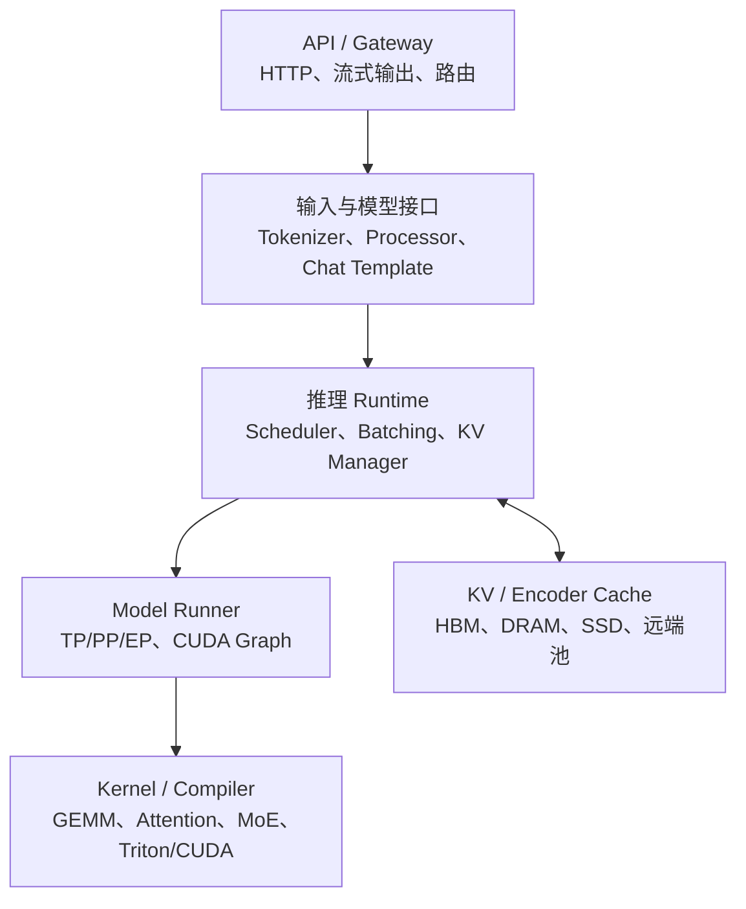

llm inferrence


> 在 vLLM 上做多级 KV Cache，准确地说属于 **LLM inference serving system 中的分层内存管理、数据传输与调度协同**。

它横跨三层：

- Runtime：KV block 的分配、引用、状态转换；

- Memory/storage system：HBM、DRAM、NVMe、远端内存之间的放置与搬运；

- Serving scheduler：什么时候加载、驱逐、等待、重计算、换一个请求运行。

如果只是接一个存储后端，偏框架工程；如果提出新的缓存价值模型、异步预取机制、KV-aware 调度，并在真实 trace 和 SLO 下验证，就是比较完整的推理系统研究。

---

# 一、先建立完整的推理软件栈

“模型 interface、runtime、framework、server”经常混在一起，其实是不同层。



## 1. 模型接口层 Model Interface

这一层回答：

> “怎样让 runtime 知道这个模型应该如何加载和执行？”

一般包含：

- `config.json`：层数、hidden size、attention 类型；

- tokenizer、chat template；

- 多模态 processor；

- 权重加载与参数名称映射；

- `forward(input_ids, positions, ...)`；

- multimodal embedding 如何插入文本 token；

- logits、sampling、structured output；

- 是否支持 TP、PP、LoRA、量化；

- 模型有什么运行时状态：
  
  - KV Cache；
  
  - Mamba state；
  
  - encoder output；
  
  - speculative decoding auxiliary states。

Hugging Face Transformers 主要提供参考模型接口；vLLM、SGLang、TensorRT-LLM 会把训练相关逻辑去掉，换成适合推理 runtime 管理 KV、并行和权重的实现。vLLM 的模型接入通常包括改写 forward、实现权重加载，并按需替换为 tensor-parallel linear/embedding；TensorRT-LLM 也有独立的模型定义、权重加载和注册接口。[vLLM 模型接入说明](https://docs.vllm.ai/en/v0.6.4.post1/models/adding_model.html)、[TensorRT-LLM 模型接入说明](https://nvidia.github.io/TensorRT-LLM/torch/adding_new_model.html)

所以：

- 加一个新模型类：模型适配/框架支持；

- 给新 attention 设计高效 kernel：算子/编译器工作；

- 为它重新设计 cache layout 和 scheduler：runtime/system 工作。

## 2. Runtime

Runtime 是真正处在请求执行热路径上的部分：

- 哪些请求本轮运行；

- 每个请求运行几个 token；

- KV 放在哪里；

- 是否进行 preemption；

- 选择哪个 attention backend；

- 怎样形成 GPU batch；

- 是否重放 CUDA Graph；

- 跨 GPU 如何通信。

vLLM 当前架构中，API Server 负责 HTTP、输入处理和流式输出；Engine Core 负责 scheduler 与 KV cache；GPU Worker 加载权重并执行模型。[vLLM 架构说明](https://docs.vllm.ai/en/v0.19.1/design/arch_overview/)

## 3. Serving Framework

Serving framework 通常把以下部分组合起来：

- 模型接口；

- runtime；

- OpenAI-compatible API；

- metrics；

- 多 GPU；

- 多 LoRA；

- quantization；

- fault handling。

vLLM、SGLang、TensorRT-LLM 都同时具有“框架”和“runtime”的属性。

## 4. 集群级推理系统

这层管理多个推理实例：

- 请求路由；

- Data Parallel 副本；

- Prefill/Decode 分离；

- KV-aware routing；

- KV 跨节点传输；

- 多级共享缓存；

- 自动扩缩容；

- admission control；

- 故障转移。

Mooncake、NVIDIA Dynamo、llm-d 等主要位于这里。Dynamo 自己的定位就是推理引擎上方的协调层，不替代 vLLM、SGLang 或 TensorRT-LLM。[NVIDIA Dynamo](https://github.com/ai-dynamo/dynamo)

---

# 二、为什么 LLM 推理需要特殊 runtime

自回归推理分成两个性质不同的阶段。

## 1. Prefill

输入 (T) 个 prompt token，一次或分块计算所有 token 的表示，并产生 KV Cache。

特点：

- GEMM 通常较大；

- 并行度高；

- 通常偏 compute-bound；

- 长上下文时 attention 的二次复杂度也可能占据主导；

- 主要影响 TTFT。

## 2. Decode

每一步只生成一个或少数几个新 token，但需要：

- 重新读取模型权重；

- 读取此前所有相关 KV；

- 进行 sampling；

- 重复几十到几千次。

低 batch 下通常是 memory-bandwidth-bound；batch 上升后，权重读取可以在请求之间摊销，但 KV attention、通信或计算又可能成为瓶颈。

KV 大小近似为：


其中：

- 2：K 和 V；

- (L)：层数；

- (T)：上下文长度；

- (H_{\mathrm{kv}})：KV head 数；

- (D_{\mathrm{head}})：head dimension；

- (B_{\mathrm{dtype}})：每个元素的字节数。

例如一个假想模型：

- 32 层；

- 8 个 KV heads；

- head dim 128；

- BF16；

- 32K context；

KV 大约就是 4 GiB/请求。

这也是为什么 GQA、MQA、FP8 KV、PagedAttention、多级缓存都非常重要。MLA、滑动窗口和混合 attention 模型的公式会不同。

---

# 三、vLLM 核心机制逐项解释

## 1. Continuous Batching

传统静态 batching：

1. 收集一批请求；

2. 一起执行；

3. 必须等整批请求都完成；

4. 才能接纳下一批。

但不同请求输出长度差异极大。一个请求生成 20 token，另一个生成 2000 token，前者完成后会在 batch 中留下空洞。

Continuous Batching，也叫 iteration-level scheduling：

- 每次 decode iteration 后重新组织 batch；

- 已完成请求立即移除；

- 新请求可以立即加入；

- 每个请求可以处于不同序列长度；

- scheduler 按本轮 token budget 组织执行。

这类 iteration-level scheduling 可以追溯到 Orca。[Orca OSDI 2022](https://www.usenix.org/conference/osdi22/presentation/yu)

它解决的是：

- batch 内长度不一致；

- GPU slot 浪费；

- 在线请求不断到达；

- 静态 batch 的 head-of-line blocking。

代价是：

- scheduler 每轮都要做决策；

- 动态 shape 增加 CPU 开销；

- CUDA Graph 需要 shape bucket；

- 请求公平性和吞吐之间冲突；

- 一个大 batch 可能提高总吞吐，却恶化单用户 TPOT。

## 2. PagedAttention

普通实现往往为一个请求预留连续的最大 KV 空间：

```text
请求A：[已使用][已使用][空闲][空闲][空闲...]
请求B：[已使用][空闲][空闲...]
```

这会造成：

- 预留浪费；

- 内存碎片；

- 很难增长；

- 很难共享前缀；

- 搬移连续 KV 成本高。

PagedAttention 借鉴操作系统虚拟内存：

```text
逻辑 block 0 -> 物理 KV page 73
逻辑 block 1 -> 物理 KV page 12
逻辑 block 2 -> 物理 KV page 91
```

每个请求只看见自己的逻辑 block table，底层物理页不要求连续。attention kernel 根据 block table 读取 KV。

它带来的能力包括：

- 按需增长；

- 显著减少外部碎片；

- prefix block 可以被多个请求共享；

- 通过 reference counting 管理共享；

- beam search 等场景可使用 copy-on-write。

vLLM 的 PagedAttention 工作明确把它定位成基于分页的 KV 内存管理。[PagedAttention / vLLM SOSP 2023](https://arxiv.org/abs/2309.06180)

但它也有代价：

- attention kernel 多了一层地址间接访问；

- block 太小：metadata、hash、block table 开销增加；

- block 太大：尾块内部碎片增加；

- 非连续布局可能影响访存合并；

- hybrid attention 模型的不同层可能需要不同 KV page 组织方式。

## 3. KV Block Manager

PagedAttention 是“GPU 如何读取分页 KV”。

KV Block Manager 是“谁来管理这些页”。

它通常负责：

- free block pool；

- block allocation/free；

- logical-to-physical block table；

- reference count；

- pin/unpin；

- prefix block 生命周期；

- preemption；

- cache hit/miss；

- 多层 KV group；

- tier residency 状态；

- 正在加载、写回、驱逐等状态转换。

所以二者的区别类似：

- PagedAttention：分页数据的执行机制；

- KV Block Manager：分页数据的操作系统内存管理器。

## 4. Prefix Cache

假设多个请求共享：

```text
System prompt + 文档 + 用户问题
System prompt + 文档 + 另一个用户问题
```

前面的 system prompt 和文档完全相同时，对应 KV 也相同，可以直接复用，不必重新 prefill。

典型实现会为 block 计算链式 hash：


$h_i = H(h_{i-1},\mathrm{tokens}_i,\mathrm{extra})$

`extra` 可能包含：

- model revision；

- LoRA ID；

- multimodal content hash；

- cache salt；

- tokenizer/template 相关信息。

Prefix Cache 主要减少：

- 重复 system prompt；

- 多轮对话历史；

- RAG 中重复长文档；

- agent 中重复工具说明；

- few-shot examples。

SGLang 的 RadixAttention 会把共享 token prefix 组织成 radix tree，并基于 LRU 管理可复用 KV。[SGLang 论文](https://arxiv.org/abs/2312.07104)

需要注意：

- 通常只能复用完整 block；

- 只对完全相同 token prefix 生效，不是语义相似；

- 主要减少 prefill，不减少后续 decode；

- 多副本环境下缓存会分散；

- cache-aware routing 可能导致热点实例过载；

- 多租户下必须考虑 cache key 隔离和侧信道风险。

## 5. Chunked Prefill

一个 100K token 的 prefill 可能长时间占据 GPU，期间正在 decode 的请求无法及时产生下一个 token，于是 ITL/P99 TPOT 爆炸。

Chunked Prefill 把它拆成：

```text
Prefill chunk 1
Decode batch
Prefill chunk 2
Decode batch
Prefill chunk 3
...
```

本质上是在每轮设置 `max_num_batched_tokens`，优先放 decode，再把剩余 token budget 给 prefill。

它解决：

- 长 prefill 阻塞 decode；

- TTFT 和 TPOT 的冲突；

- prefill/decode 混合 batch 利用率差。

Sarathi-Serve 系统性研究了 chunked prefill 和 stall-free scheduling。[Sarathi-Serve OSDI 2024](https://www.usenix.org/conference/osdi24/presentation/agrawal)

代价：

- chunk 太小：prefill GEMM 变小、GPU 效率下降；

- chunk 太大：decode 仍会被干扰；

- 一个请求的 TTFT 可能变长；

- scheduler iteration 和 metadata 操作增多。

vLLM V1 当前默认围绕 chunked prefill 和 token budget 进行调度，并通常优先安排 decode。[vLLM 优化说明](https://docs.vllm.ai/en/stable/configuration/optimization/)

## 6. CUDA Graph

普通执行中，CPU 每轮都要 launch 很多 CUDA kernels。Decode batch 小时，单个 kernel 很短，CPU launch、Python、dispatcher 的开销可能接近 GPU 计算本身。

CUDA Graph 会：

1. 捕获一组 GPU 操作；

2. 保存依赖关系；

3. 后续直接 replay；

4. 减少 CPU launch overhead。

它对小 batch decode 尤其有效。

但动态 serving 的形状不断变化，因此通常要：

- 按 batch size 捕获多个 graph；

- 对请求数进行 padding；

- 使用 piecewise graph；

- 不支持的动态分支回退 eager。

它和 `torch.compile` 不同：

- CUDA Graph 主要减少启动开销；

- `torch.compile` 主要做图优化、融合和代码生成；

- 两者可以组合。

## 7. 多 GPU 推理

| 方式     | 核心机制                      | 主要解决问题        | 主要代价                   |
| ------ | ------------------------- | ------------- | ---------------------- |
| DP     | 多个完整模型副本                  | 提高集群吞吐        | 权重重复、缓存分散              |
| TP     | 每层矩阵按 GPU 切分              | 模型放不下、降低单请求延迟 | 每层 AllReduce/AllGather |
| PP     | 不同 GPU 放不同层               | 降低单卡权重占用      | pipeline bubble、调度复杂   |
| EP     | 不同 GPU 放不同专家              | MoE 权重与计算扩展   | All-to-All、专家负载不均      |
| CP/DCP | 序列或 KV 沿上下文切分             | 超长上下文         | attention 通信和负载均衡      |
| P/D 分离 | Prefill、Decode 使用不同 GPU 池 | 阶段隔离、独立扩容     | 必须传输 KV                |

经验上：

- 同节点高速 NVLink/NVSwitch：TP 比较自然；

- 跨节点慢网络：过大的 TP 经常被通信拖垮；

- 只需要提高吞吐：优先考虑 DP；

- MoE：重点往往是 EP All-to-All 和 expert imbalance；

- 极长上下文：模型是否放得下之外，还要考虑 KV 是否放得下。

---

# 四、多级 KV Cache 真正是什么

一个典型逻辑层次可以写成：

| Tier | 介质                | 大致特性              | 常见用途             |
| ---- | ----------------- | ----------------- | ---------------- |
| L1   | GPU HBM           | 最快、最贵、容量小         | 正在 decode 的活跃 KV |
| L2   | CPU pinned DRAM   | 容量大，受 PCIe/CXL 限制 | 暂停会话、热门前缀        |
| L3   | 本地 NVMe           | 更大但延迟高            | 长会话、低频 prefix    |
| L4   | 远端 DRAM/NVMe/并行存储 | 可跨实例共享            | 集群级 KV pool      |

L1/L2/L3 的命名并不统一。例如 SGLang HiCache 把 GPU、host memory、distributed storage 分别称为 L1、L2、L3。[SGLang HiCache 设计](https://docs.sglang.ai/advanced_features/hicache_design.html)

## 一个非常重要的修正

不能简单理解为：

> “老 token 的 KV 比较冷，可以随便移到 SSD。”

对于标准 full attention，正在 decode 的请求每生成一个 token，都需要访问此前全部 KV：

[  
q_t K_{1:t}^{T}  
]

所以一个活跃请求的早期 KV block 仍然会在每一步被读取，它并不“冷”。

适合下沉的通常是：

- 尚未进入执行的请求前缀；

- 已暂停或被抢占请求；

- 多轮会话下一轮可能复用的 KV；

- 全局共享 system prompt/RAG 文档；

- 当前没有活跃引用的 prefix block；

- 滑动窗口或稀疏 attention 已经不再访问的 block。

如果把 full-attention 活跃请求的一部分 KV 放到 NVMe，每个 decode step 都发生缺页和加载，性能往往会完全崩掉。

---

# 五、多级 KV 的核心机制

## 1. Cache Identity

一个 KV block 不能只用 token hash 标识，还应考虑：

- model ID 和权重版本；

- tokenizer；

- chat template；

- token sequence；

- position/RoPE 状态；

- KV dtype；

- TP/PP layout；

- LoRA adapter；

- multimodal embedding/content ID；

- attention backend/cache layout；

- tenant/security namespace。

否则会发生“命中了错误 KV”的严重正确性问题。

## 2. Prefetch

基本流程是：

```text
请求进入等待队列
→ 查 block metadata
→ 计算可复用 prefix
→ 选择执行实例
→ 异步加载 L2/L3 KV
→ scheduler 暂时执行其他请求
→ KV 到达 HBM
→ 请求变为 READY
```

Prefetch 的关键不是“搬得快”，而是：

> 搬运能不能藏在排队和其他请求计算后面。

判断是否值得加载的最基本条件是：

$  
T_{\mathrm{fetch}} + T_{\mathrm{queue/interference}}  
<  
T_{\mathrm{re-prefill}}  
$

其中：

$  
T_{\mathrm{fetch}}  
\approx  
T_{\mathrm{lookup}}  \frac{\mathrm{bytes}}{\mathrm{effective\ bandwidth}}  T_{\mathrm{protocol}}  T_{\mathrm{layout\ transform}}  
$

“带宽很高”不代表一定有收益，因为小块传输可能主要受固定延迟、metadata 和同步影响。

## 3. Eviction

不能仅看 LRU。一个更合理的 block 价值密度可以写成：

$Vi​=bytesi​Pi​(deadline 前复用)(Trecompute,i​−Trestore,i​)−Cpollution,i​−Cwriteback,i​​$

优先驱逐低价值 block。

实际还要考虑：

- active decode/reference count：通常不能驱逐；

- prefix 被多少请求共享；

- prefix 长度；

- 下一层存储位置；

- 当前 PCIe/NIC 拥塞；

- 用户 SLO 和优先级；

- 是否已经存在远端副本；

- 写回是否与计算重叠；

- 热点 prefix 是否应该复制，而非集中保存一份。

## 4. Scheduler Integration

KV 未就绪时有三个选择：

1. 等待 KV；

2. 调度其他请求；

3. 放弃加载并重新 prefill。

因此需要维护类似：

```text
WAITING_METADATA
PREFETCHING
READY
RUNNING
EVICTING
REMOTE_ONLY
FAILED
```

如果只实现异步 DMA，却不改 scheduler，常见结果是：

- GPU 仍然等待 I/O；

- 预取无法隐藏；

- HBM 被错误预取污染；

- 高 cache hit rate 但 TTFT 没有改善。

## 5. 数据布局

计算友好布局和 I/O 友好布局往往不同：

- 计算侧可能是 layer-major；

- 存储侧希望把一个 page 的所有层放在一起；

- TP rank 之间的 shard 方式不同；

- Prefill 与 Decode 可能使用不同 TP/PP 配置。

因此真实系统还要解决：

- pack/unpack；

- layout transformation；

- scatter/gather；

- GPUDirect/RDMA；

- 多 rank 同步；

- checksum 与版本一致性。

这部分很容易成为“看起来网络有 400 Gbps，实际只有几十 Gbps”的原因。

---

# 六、Mooncake解决的是什么

Mooncake 不是简单的“vLLM 上面加一个 SSD cache”，而是完整的集群级 KV-centric 架构：

1. Conductor 为请求选择 prefill 和 decode 实例；

2. 尽量把可复用 KV 加载到 prefill 实例；

3. 分块完成 prefill；

4. 持续把产生的 KV 传给 decode 实例；

5. decode 实例加入 continuous batching；

6. 根据 prefix locality、排队、TTFT/TBT SLO 做全局决策；

7. 过载时提前拒绝请求，避免已经做完 prefill 后才发现 decode 池无容量。

Mooncake 原论文还讨论了热点 KV 复制、冷 KV 交换，以及预测式 early rejection。[Mooncake 论文](https://arxiv.org/abs/2407.00079)

P/D 分离解决两个问题：

- prefill 大计算会干扰 decode 的稳定 TPOT；

- prefill 和 decode 需要不同的资源比例及硬件特性。

但它引入了新问题：

- KV 传输可能抵消分离收益；

- P/D 资源配比动态变化；

- 输出长度不可预测；

- decode 池未来负载难预测；

- 网络和缓存节点可能成为热点；

- prefill 成功、decode 拒绝会浪费计算；

- 故障恢复需要知道 KV 到底在哪里。

DistServe、Splitwise 也分别从 goodput 和异构硬件角度研究了 P/D 分离。[DistServe](https://arxiv.org/abs/2401.09670)、[Splitwise](https://arxiv.org/abs/2311.18677)

---

# 七、主流框架各自解决什么问题

| 项目                        | 主要层次                    | 核心特点                                             | 更适合                 |
| ------------------------- | ----------------------- | ------------------------------------------------ | ------------------- |
| Hugging Face Transformers | 模型接口/参考执行               | 模型生态、正确性、训练推理统一                                  | 新模型验证、研究原型          |
| vLLM                      | 通用推理 runtime/framework  | PagedAttention、continuous batching、广泛模型支持        | 快速部署、通用生产服务         |
| SGLang                    | 程序接口 + runtime          | RadixAttention、结构化生成、agent/prefix-heavy workload | RAG、agent、多轮共享前缀    |
| TensorRT-LLM              | NVIDIA 优化 runtime       | 专用 kernel、量化、图优化、IFB、并行                          | 固定 NVIDIA 平台、追求极致性能 |
| FlashInfer                | kernel/attention engine | attention、GEMM、MoE 的统一高性能 kernel                 | 被 vLLM/SGLang 等调用   |
| LMCache                   | KV cache layer          | 跨请求、跨引擎的 KV offload/share/transfer               | 长上下文、多轮、P/D         |
| HiCache                   | SGLang 分层 KV 系统         | GPU/host/分布式三级缓存                                 | SGLang 内部多级缓存       |
| Mooncake                  | 集群级 KV 系统               | P/D 分离、分布式 KV pool、全局调度                          | 大规模长上下文服务           |
| NVIDIA Dynamo             | 集群 orchestration        | KV routing、P/D、扩缩容、多后端                           | 数据中心级服务             |
| vLLM-Omni                 | 多阶段 multimodal runtime  | AR、DiT、音频、动作 stage graph                         | any-to-any 多模态模型    |

LMCache 当前把 KV 抽象为跨引擎、跨查询可存储和传输的对象，并提供 lookup、pin、cleanup、movement、compression 等控制接口。[LMCache 论文](https://arxiv.org/abs/2510.09665)

---

# 八、多模态推理为什么比文本更复杂

典型 VLM 请求路径是：

```text
图片/视频下载
→ JPEG/视频解码
→ resize/crop/normalize/frame sampling
→ 文本 tokenizer + placeholder 展开
→ Vision/Audio Encoder
→ Projector/Resampler
→ multimodal embeddings 与文本合并
→ LLM Prefill
→ LLM Decode
→ 流式输出
```

这里至少有三种不同缓存：

| 缓存              | 缓存内容                          | 节省什么           |
| --------------- | ----------------------------- | -------------- |
| Processor cache | 解码、resize、processor 输出        | CPU 与数据处理      |
| Encoder cache   | ViT/audio encoder embeddings  | encoder GPU 计算 |
| LLM KV cache    | multimodal token 经过 LLM 后的 KV | LLM prefill    |

不能把它们统称为 KV Cache。

vLLM 的 multimodal processor 需要维护原始媒体、placeholder token 与 feature token 的对应关系，才能让 chunked prefill 和 prefix caching 正常工作；它也提供专门的 `vllm bench mm-processor` 分析 processor 到 encoder forward 的各阶段时间。[vLLM 多模态处理设计](https://docs.vllm.ai/en/stable/design/mm_processing/)、[多模态 processor benchmark](https://docs.vllm.ai/en/stable/cli/bench/mm_processor/)

## 多模态常见瓶颈

### 1. CPU/media I/O

表现：

- GPU 有大量空洞；

- TTFT 高；

- 图片 URL 比本地 tensor 慢很多；

- CPU 核心、JPEG decoder 或网络饱和。

解决：

- 异步下载；

- 本地对象缓存；

- 多进程 processor；

- GPU fused normalization；

- 请求提前解码；

- processor output cache。

### 2. Encoder 计算

表现：

- 图片数、分辨率、视频帧数增加时 TTFT 线性或超线性增长；

- ViT kernel 占据大量时间；

- LLM decode TPOT 正常。

解决：

- encoder batching；

- encoder 独立扩容；

- encoder disaggregation；

- embedding cache；

- 降低图像分辨率、动态 patch 或视频帧数；

- encoder quantization/compile/CUDA Graph。

### 3. 视觉 token 爆炸

视觉编码最后可能产生几百到几万个视觉 token，它们会同时增加：

- LLM prefill；

- KV Cache；

- attention；

- P/D KV 传输量；

- HBM 容量压力。

所以“ViT 很快”不代表整个 VLM 快，真正瓶颈可能是 ViT 产生了太多 LLM token。

### 4. 动态形状

图片尺寸、视频帧数、音频长度不同，会导致：

- batch 难拼；

- CUDA Graph 命中率下降；

- padding 浪费；

- encoder 与 LLM token cost 不匹配。

单纯用“token 数”调度不一定能准确表示多模态成本。更合理的 scheduler 需要同时估计：

$Crequest​=Cmedia​+Cencoder​+CLLM prefill​+Cdecode​$

### 5. Omni 与生成式多模态

对于文生图、文生视频、语音生成：

- diffusion 不是 token-by-token decode；

- 核心循环是多步 denoising；

- VAE encode/decode 可能很重；

- 重点变成 sequence parallel、CFG parallel、patch pipeline、stage batching；

- 中间特征缓存可能是近似缓存，会影响生成质量。

vLLM-Omni 因此引入 stage graph，把 AR、diffusion、audio codec、action 等阶段分别执行和扩容；其指标也扩展到 TTFP、音频 RTF、媒体 E2E latency。[vLLM-Omni 架构](https://docs.vllm.ai/projects/vllm-omni/en/latest/design/architecture_overview/)

对于 VLA，还需要额外关注：

- observation-to-action latency；

- action chunk 生成时间；

- control-loop jitter；

- action age / observation staleness；

- P99 是否超过控制周期；

- batching 是否为了吞吐牺牲实时性。

这时 tokens/s 经常不是最关键指标。

---

# 九、业内最常见的公共瓶颈与判断信号

| 现象                    | 更可能的瓶颈                        | 看什么                                      | 常见方案                                      |
| --------------------- | ----------------------------- | ---------------------------------------- | ----------------------------------------- |
| TTFT 高，TPOT 正常        | 排队、processor、prefill          | queue time、输入长度、CPU/GPU timeline         | prefix cache、chunked prefill、processor 并行 |
| TPOT 高且随上下文增长         | KV attention 带宽               | attention kernel、HBM bandwidth           | GQA/MLA、KV quant、稀疏 attention             |
| TPOT 高但上下文很短          | 权重带宽/launch                   | batch、CUDA gap、weight GEMM               | batching、CUDA Graph、权重量化                  |
| p50 正常，p99 很差         | burst、HOL blocking、preemption | waiting requests、长 prompt、cache pressure | admission、chunked prefill、P/D             |
| KV 使用接近 100%          | 容量瓶颈                          | cache usage、preemption、recompute         | 降并发、KV FP8、增加 HBM、offload                 |
| cache hit 高但 TTFT 不降  | 加载慢于重算                        | fetch latency、bytes、layout conversion    | 改 prefetch、聚合传输、放弃低价值 hit                 |
| GPU utilization 低     | CPU、I/O、通信或 batch 太小          | GPU 空洞、CPU flamegraph、NCCL               | CUDA Graph、异步处理、提高 batch                  |
| GPU utilization 高但吞吐低 | memory-bound 或低效 kernel       | roofline、HBM、occupancy                   | kernel/量化/layout                          |
| TP 从 2 扩到 4 反而慢       | 通信占比过高                        | NCCL 时间、NVLink/IB bandwidth              | 减 TP、改 PP/DP、通信重叠                         |
| MoE 吞吐波动              | expert imbalance/All-to-All   | 每 expert token 数、NCCL                    | EPLB、专家复制、拓扑感知 EP                         |
| VLM 图片一多就慢            | processor/encoder/视觉 token    | 分阶段 latency                              | embedding cache、encoder 分离                |
| P/D 分离后无收益            | KV transfer/比例失配              | KV bytes、传输 P99、P/D queue                | 同节点放置、RDMA、重配 P:D                         |

最重要的经验是：

> GPU utilization 只表示“某些 GPU 工作在运行”，不表示 tensor core 得到了有效利用，也不表示应用没有被内存或通信限制。

---

# 十、推理领域常用的 profiling 工具

## 1. 服务级 benchmark

| 工具                              | 用途                                  |
| ------------------------------- | ----------------------------------- |
| NVIDIA AIPerf                   | TTFT、ITL、吞吐、请求分布、GPU/server metrics |
| `vllm bench serve`              | 在线请求率、并发、输入输出长度、burstiness          |
| `vllm bench latency/throughput` | 离线延迟和吞吐                             |
| `vllm bench mm-processor`       | 多模态 processor/encoder 分阶段分析         |
| SGLang `bench_serving`          | TTFT、TPOT、ITL、吞吐                    |
| `trtllm-bench`                  | TensorRT-LLM 配置搜索与性能测试              |
| MLPerf Inference                | 标准化、可复现的系统对比                        |

AIPerf 是当前 NVIDIA 对 GenAI-Perf 的后续替代，并能采集 vLLM、SGLang、TensorRT-LLM、Dynamo 等 Prometheus endpoint 和 DCGM GPU telemetry。[AIPerf 说明](https://docs.nvidia.com/aiperf/getting-started/migrating-from-gen-ai-perf)

一定要用 streaming，否则无法准确测 TTFT 和 ITL。

## 2. 在线 observability

- Prometheus；

- Grafana；

- vLLM/SGLang/TRT-LLM `/metrics`；

- OpenTelemetry；

- Jaeger/Tempo；

- DCGM Exporter。

重点指标：

- running/waiting requests；

- prompt/output tokens/s；

- TTFT/TPOT/ITL P50/P95/P99；

- KV cache utilization；

- prefix hit rate；

- preemption/recompute；

- scheduler iteration time；

- batch token 数；

- speculative acceptance；

- P/D queue depth；

- KV transfer bytes/latency；

- encoder cache hit rate。

vLLM 自带运行中请求数、等待请求数、GPU cache 使用率、prompt/output token throughput 和 prefix hit rate等指标。[vLLM metrics](https://docs.vllm.ai/en/stable/design/metrics/)

## 3. GPU timeline

### Nsight Systems

首先使用它看：

- CPU 与 GPU 是否重叠；

- GPU 时间线上有没有空洞；

- kernel launch 是否密集；

- CUDA Graph 是否 replay；

- NCCL 是否阻塞；

- memcpy 是否和计算重叠；

- prefill/decode 的时间结构；

- 多 GPU 是否存在 straggler。

vLLM 官方建议性能关键场景优先使用 Nsight Systems；PyTorch Profiler 信息更丰富但开销更高。[vLLM Profiling](https://docs.vllm.ai/en/latest/contributing/profiling/)

### PyTorch Profiler

适合看：

- Python op 到 CUDA kernel 的映射；

- tensor shape；

- stack trace；

- CPU time；

- CUDA time；

- memory allocation。

不适合长时间生产压测，因为 tracing 会显著扰动结果。

### Perfetto

查看 PyTorch、Proton、Chrome trace，适合跨线程和跨进程时间线。

## 4. Kernel 级

### Nsight Compute

当 Nsight Systems 已经找到最重的 2～3 个 kernel，再用 NCU 看：

- arithmetic intensity；

- tensor core utilization；

- DRAM/L2 bandwidth；

- occupancy；

- warp stall reason；

- register pressure；

- shared memory；

- memory coalescing；

- roofline 位置。

不要一上来就对整个 serving 进程跑 NCU：开销大、数据过多，而且很可能在优化一个并非端到端瓶颈的 kernel。

### Triton Proton

适合 Triton kernel 的层次化 profiling。vLLM 当前也支持 Proton trace 和 Perfetto/hatchet 输出。[vLLM Proton 支持](https://docs.vllm.ai/en/latest/contributing/profiling/)

## 5. GPU 通信与 KV 搬运

- `nccl-tests`：AllReduce、AllGather、All-to-All；

- `nvbandwidth`：GPU↔GPU、CPU↔GPU 带宽；

- `nvidia-smi topo -m`：拓扑；

- NIXLBench/KVBench：KV 数据传输；

- `ib_write_bw`、`ib_read_bw`、`ib_send_bw`：InfiniBand/RDMA；

- `ucx_perftest`：UCX；

- Nsight Systems NCCL trace；

- DCGM diagnostics。

`nccl-tests` 用于验证通信正确性和实际 collective 带宽。[NVIDIA nccl-tests](https://github.com/NVIDIA/nccl-tests)

## 6. CPU、网络、存储

- `perf`、FlameGraph：CPU hot path；

- `py-spy`：Python scheduler/tokenizer；

- `pidstat`、`mpstat`、`numastat`：CPU/NUMA；

- eBPF/BCC/bpftrace：网络、文件、调度延迟；

- `iostat`、`fio`：NVMe；

- `sar`、`ss`、`ethtool`：网络；

- page-fault、pinned-memory、NUMA locality 指标。

---

# 十一、一套真正有效的瓶颈定位流程

## 第一步：固定实验条件

至少固定：

- 模型和 revision；

- weight/KV dtype；

- GPU 型号和拓扑；

- TP/PP/DP/EP；

- attention backend；

- 输入长度分布；

- 输出长度分布；

- prefix reuse；

- 图片分辨率/视频帧数；

- request arrival pattern；

- SLO。

否则 tokens/s 对比没有意义。

## 第二步：做四类隔离实验

### Prefill test

- output length = 1；

- input length：128、1K、8K、32K；

- 关闭 prefix reuse。

看 TTFT 如何随输入长度变化。

### Decode test

- 固定短 prompt；

- output length：256 或 1024；

- 分别测试短上下文和长上下文。

看 TPOT 是否随 context 增长。

### Scheduler test

- 固定输入输出长度；

- 用 open-loop request rate 扫描；

- 再测试 Poisson 和 burst traffic。

寻找“吞吐不再增长，但 P99 急剧上升”的 saturation knee。vLLM benchmark 支持 request rate 与 burstiness；SGLang 也建议使用在线 `bench_serving` 测 TTFT、TPOT、ITL。[vLLM bench serve](https://docs.vllm.ai/en/stable/cli/bench/serve/)、[SGLang benchmarking](https://docs.sglang.ai/developer_guide/benchmark_and_profiling.html)

### Cache test

分别构造：

- cold miss；

- L1 hit；

- DRAM hit；

- NVMe hit；

- remote hit；

- 部分 prefix hit。

记录：

- lookup；

- transfer；

- H2D；

- wait；

- saved prefill；

- 最终 TTFT。

不要只报告 hit rate。

## 第三步：观察 metrics

先判断问题属于：

- queue；

- CPU/input；

- prefill；

- decode；

- KV capacity；

- communication；

- cache I/O。

## 第四步：Nsight Systems

确认：

- GPU 是否在等 CPU；

- decode 是否被 prefill 阻塞；

- memcpy 是否重叠；

- NCCL 是否是关键路径；

- CUDA Graph 是否有效。

## 第五步：Nsight Compute

只有确认某个 kernel 占据关键路径后，才做 kernel roofline 和硬件计数器分析。

---

# 十二、几个非常实用的经验判断

1. **TTFT 高、TPOT 低**：不要先优化 decode attention，先查 queue、processor、prefix miss 和 prefill。

2. **TPOT 随 context length 明显变差**：优先怀疑 KV attention，而不是权重 GEMM。

3. **低并发很慢，高并发吞吐突然变好**：通常是 weight bandwidth 或 kernel launch 被 batch 摊销。

4. **高并发吞吐好但 P99 崩掉**：scheduler 正在用用户延迟换吞吐。

5. **KV hit rate 高不等于缓存有效**：必须看命中的 token 数、节省的 prefill 时间，以及 fetch 是否比重算快。

6. **GPU utilization 低但 HBM 占满**：这是 capacity 问题，不一定是执行性能问题。

7. **TP 扩展效率差**：先用 NCCL test 检查物理带宽，再看 runtime；不要直接认为 kernel 不好。

8. **多模态请求变慢**：先把 URL 下载、processor、encoder、LLM prefill 分开计时。

9. **只测无限并发吞吐会掩盖系统问题**：生产研究应报告 SLO 下 goodput，而不是只有 tokens/s。

10. **平均值通常没用**：至少报告 P50、P95、P99 TTFT/ITL/E2E。

---

# 十三、当前真正值得做的研究问题

在多级 KV 方向，比较有研究价值的切口是：

- reuse probability + transfer congestion + SLO 联合驱逐；

- scheduler-aware asynchronous prefetch；

- cache-aware routing 与 load balance 的联合优化；

- 不同 TP/PP layout 间的零拷贝 KV 转换；

- prefix 热点的自适应复制；

- 活跃 KV、会话 KV、共享 prefix KV 的分类型策略；

- P/D/encoder 三阶段联合资源配置；

- 多模态 processor、encoder embedding、LLM KV 的统一缓存；

- burst workload 下的预测式 admission control；

- VLA 中以 control deadline 而非 token throughput 为目标的调度。

评价一个工作是不是系统研究，可以检查它有没有同时回答：

1. 什么真实 workload 暴露了瓶颈？

2. 为什么现有机制解决不了？

3. 提出了什么新的 abstraction 或 policy？

4. 怎样与 scheduler、memory、hardware data path 协同？

5. 在什么条件下有效、什么时候无效？

6. 是否用真实 trace、SLO、P99 和 ablation 验证？

7. 是否与 LRU、LFU、无缓存、重计算、单级缓存进行公平比较？

如果这些问题都能回答，那么它就不再只是“在 vLLM 中接了一个多级 KV Cache”，而是一项完整的 inference system 工作。
