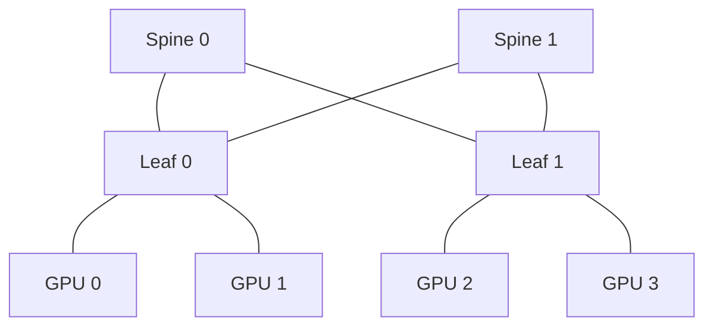

Intra-node parallelism

via high-speed interconnects

High-speed inter-node parallelism

Split up memory and compute requirements across GPUs and machines

**把模型分到很多 GPU/TPU 上以后，计算结果怎样交换，网络能不能跟上计算速度？**

可以把它理解成三件相互关联的事：

- **模型怎么拆**：数据并行、张量并行、流水线并行、专家并行。

- **拆开后需要传什么**：梯度、激活、token、部分计算结果。

- **硬件怎样连接**：NVSwitch、mesh/torus、树形交换网络，以及更大范围的数据中心网络。

**并行方式决定通信需求，网络结构又限制哪些并行方式更划算。**下面结合你的图片讲。

---

先理解最后一页的这句话：**“Split up memory and compute requirements across GPUs and machines”——把内存需求和计算需求分摊到多张卡、多台机器上。**

例如，一个 70B 参数模型，仅 BF16 权重就大约需要：

推理还需要 KV cache、激活和临时空间；训练还需要梯度、优化器状态等。因此，我们需要让不同设备分别存储、计算模型的一部分。

但是，**计算可以拆，数据依赖不会自动消失**。假设 GPU 0 算前半部分，GPU 1 算后半部分，那么 GPU 0 的输出必须传给 GPU 1。拆得越细，往往通信越频繁。

这里先分清两组容易混淆的概念：

| 概念         | 描述的是什么          | 例子                          |
| ---------- | --------------- | --------------------------- |
| Intra-node | 同一台服务器内部        | 一台服务器中的 8 张 GPU             |
| Inter-node | 不同服务器之间         | 两台 GPU 服务器之间                |
| Scale-up   | 建立紧密耦合的高速加速器互联域 | NVLink/NVSwitch 域、TPU ICI 域 |
| Scale-out  | 把更多节点或互联域连接成大集群 | InfiniBand、以太网/RoCE、Virgo   |

**Scale-up 不等于“单机内部”。**一个高速互联域可以跨服务器，甚至跨多个机柜。反过来，一个集群里的所有 GPU 能互相通信，也不代表它们都处在同一个 NVLink 域中。

---

**先看那张包含 CPU、PLX、HCA、GPU、NVSwitch 的图。**它展示了同一台服务器中同时存在的几套连接。

| 图中部件        | 含义                                 | 主要职责               |
| ----------- | ---------------------------------- | ------------------ |
| CPU₀、CPU₁   | 两个 CPU 插槽                          | 运行主机程序、调度任务、管理 I/O |
| xGMI-2      | 图中的 CPU 间互连                        | 两个 CPU 插槽之间交换数据    |
| PCI Express | 通用外设互连                             | 连接 CPU、GPU、网卡等     |
| PLX         | 图中的 PCIe 交换芯片                      | 让多块 PCIe 设备连接、交换数据 |
| HCA         | Host Channel Adapter，InfiniBand 网卡 | 把服务器接入外部高速网络       |
| NVLink      | NVIDIA 的高速互连链路                     | 传输 GPU 之间的数据       |
| NVSwitch    | 交换 NVLink 数据的芯片                    | 让多个 GPU 通过交换网络互通   |

注意图中的颜色：**黑色 PCIe、绿色 NVLink、紫色 InfiniBand，代表不同的数据通路。**

同一台机器中的 GPU 0 向 GPU 7 发送数据，可以走：

因此，不需要先把全部数据复制到 CPU 内存，再从 CPU 内存搬到另一张 GPU。

向另一台机器发送数据，则可能走：

在支持 **GPUDirect RDMA** 的配置中，网卡可以直接读写 GPU 内存，避免经过 CPU 内存中的中转缓冲区；CPU 仍可能参与任务提交和控制。[NVIDIA GPUDirect RDMA 文档](https://docs.nvidia.com/cuda/gpudirect-rdma/index.html)

图中 GPU 与 HCA 的位置关系也有意义：GPU 选择哪个网卡传输，可能影响是否需要绕过额外的 PCIe 层级或 CPU 插槽。**“同一台服务器里的设备”并不意味着通信代价完全相同。**

这张图顶部的速率标注也要注意。`GT/s` 是每秒传输次数，`Gb/s` 是每秒多少比特，`GB/s` 是每秒多少字节，不能直接混用。

例如，PCIe 4.0 ×16 单方向的理论带宽，考虑线路编码后约为：

而图中 **NVLink 3.0 的“400 GT/s per lane”标注不准确**。NVIDIA 给出的 A100 数据是：每条 NVLink 单方向 25 GB/s，12 条链路合计单方向 300 GB/s、双方向合计 600 GB/s。[NVIDIA Ampere 架构详解](https://developer.nvidia.com/blog/nvidia-ampere-architecture-in-depth/)

---

再看红色连线、排列成方格的 TPU 图片：**toroidal mesh 指“边界首尾相连的网格”，通常称为 torus，环面拓扑。**

普通二维 mesh 可以理解成棋盘：

- 芯片与上下左右邻居连接。

- 边缘芯片缺少某些方向的邻居。

- 从最左边到最右边，要经过中间芯片。

Torus 在此基础上加入“绕回连接”：

- 每一行的最左边与最右边相连。

- 每一列的最上边与最下边相连。

所以，你图中那些绕到外面的红线，并不是让数据广播给整行，而是表示**网格两端也存在连接**。

以图中的 网络为例：

- 从 到 ，普通 mesh 需要沿该方向走 3 跳。

- Torus 可以利用首尾连接，只走 1 跳。

这里的 **hop，跳数**，表示经过多少段网络连接。

二维 torus 通常每颗芯片有 4 个相邻方向；三维 torus 则有 6 个：

三维不用想成芯片真的摆成立方体，重点是它们在网络中的连接关系。

对规则的 三维 torus：

最远两点的最短路径长度为：

例如 颗芯片，最远需要 12 跳。因此它具有一种取舍：**每颗芯片只需要有限数量的邻居连接，但系统扩大后，远距离通信需要更多跳。**

TPU 的具体拓扑随代际和 slice 配置变化。比如 TPU v4 支持可重配置互连和 twisted 3D torus，并非所有 TPU 都能用一张固定的二维网格图概括。[TPU v4 官方论文](https://arxiv.org/abs/2304.01433)

---

现在看 PPT 的 **“GPU networking：All-to-all，up to 256”**。

这里必须区分三个不同含义：

| 说法              | 准确含义                  |
| --------------- | --------------------- |
| 物理全连接           | 每两个端点之间都有直接链路         |
| 任意互通的交换网络       | 任意两个端点可以经过交换机通信       |
| All-to-all 集合通信 | 每个参与者向其他参与者发送各自对应的数据块 |

**NVSwitch 系统中的“全互联”，主要是在说第二种能力。**

它不是给 256 张 GPU 中的每一张都接上另外 255 张的直连线。否则，单条无向链路连接一对 GPU 时，需要：

条链路。

交换网络通过中间交换机实现任意互通，可以避免这种逐对布线。

而且，**任意互通不代表一张 GPU 同时向所有其他 GPU 都能各自跑满标称带宽**。一张 GPU 的总发送能力要由所有目的地共享；多个发送者同时冲向一个接收者，也会受接收端带宽限制。

你第一张 A100/H100 SuperPOD 图，展示的是一个具体历史方案：

- 左侧 A100：节点内使用 NVLink/NVSwitch，节点间经过 InfiniBand leaf/spine 网络。

- 右侧 H100：增加节点外的 NVLink Switch，把 NVLink 域扩展到 32 台服务器、256 张 GPU。

**“256”对应当时提出的特定 NVLink Switch System 配置，不是所有 H100 集群的默认连接方式，也不是 GPU 网络永远只能扩展到 256 张。**NVIDIA 的 DGX H100 SuperPOD 参考架构中，跨节点网络仍采用 InfiniBand。[第三代 NVSwitch 方案说明](https://developer.nvidia.com/ja-jp/blog/upgrading-multi-gpu-interconnectivity-with-the-third-generation-nvidia-nvswitch/)、[DGX H100 SuperPOD 网络架构](https://docs.nvidia.com/dgx-superpod/reference-architecture-scalable-infrastructure-h100/latest/network-fabrics.html)

图下方有两个网络指标尤其值得理解：

| 指标                       | 含义                   | 对模型有什么影响          |
| ------------------------ | -------------------- | ----------------- |
| Bisection bandwidth，二分带宽 | 把网络分成两半后，两半之间可通过的总带宽 | 大范围交换数据时，网络中间会不会堵 |
| Reduce bandwidth，归约带宽    | 按特定定义衡量归约操作的处理能力     | 梯度求和、部分结果合并等操作有多快 |

按截图数字，256 GPU 系统的二分带宽从 6,400 GB/s 增加到 57,600 GB/s，是 9 倍；Reduce 列从 100 增加到 450 GB/s，是 4.5 倍。

**这两个比例都不能直接当成模型训练速度的提升比例。**它们衡量的是不同通信能力，而且该 H100 方案还使用了交换网络中的归约加速。图中 Dense PFLOP/s 一列未标明计算精度，跨代比较时也必须确认 BF16/FP16、FP8 等口径是否一致。

---

接下来理解 **“Mesh vs tree vs other：为什么用 mesh，为什么用 tree？”**

首先，PPT 中的 tree 通常泛指 **fat-tree 或 Clos/leaf-spine 一类交换网络**，不宜理解为“所有数据都必须经过唯一根节点”的普通树。

普通树可能存在明显的上层瓶颈。Fat-tree/Clos 则通过增加上层带宽和并行路径，使大量设备可以同时跨区域通信。

下面是一个简化的 leaf-spine 网络：

GPU 0 到 GPU 3 可以经过不同的 spine。它虽然看起来分层，却存在多条路径，并非图论意义上的普通树。

几种网络的主要取舍如下：

| 拓扑              | 连接特点               | 优势             | 主要代价           |
| --------------- | ------------------ | -------------- | -------------- |
| Ring            | 每个端点连接两个邻居         | 简单，适合某些流式集合通信  | 规模大时跳数多        |
| Mesh / torus    | 连接少数邻居，torus 加首尾连接 | 端口需求低，规则通信容易映射 | 远距离交换占用多段链路    |
| 普通树             | 通过共同祖先连接           | 结构简单，便于汇聚      | 上层链路容易形成瓶颈     |
| Fat-tree / Clos | 分层交换，多条并行路径        | 更容易承载广泛的端点间通信  | 需要更多交换资源、线缆和功耗 |
| Dragonfly 类     | 组内连接加组间高速连接        | 用分组结构缩短全局路径    | 要处理全局链路拥塞和路由问题 |

这里还有一个容易混淆的地方：**物理拓扑和通信算法不是一回事。**

例如，物理上是 leaf-spine 的网络，仍然可以执行 ring AllReduce；物理上是 torus，也可以执行 All-to-all。前者描述“线怎么连”，后者描述“数据按什么步骤传”。

PPT 说 mesh **“Cheaper to operate”**，背后的考虑通常是：

- 每颗芯片只需要连接少数邻居。

- 可以减少部分独立交换设备和高成本长距离连接。

- 若通信模式规则，很多链路可以持续、均衡地工作。

但它不是“mesh 在任何情况下都更便宜”。如果工作负载大量跨越整个网络，多跳转发、拥塞和等待也会带来成本。比较时必须同时看性能目标和通信模式。

---

**为什么 PPT 把 mesh 与 Tensor Parallelism 联系起来，把 tree/A2A 与 Expert Parallelism 联系起来？**要看它们传输的数据有何不同。

先认识四个常见集合通信操作：

| 操作            | 做什么                   | 简单理解               |
| ------------- | --------------------- | ------------------ |
| AllReduce     | 把各设备的数据归约，每个设备拿到结果    | 每个人贡献一个数，所有人得到总和   |
| AllGather     | 收集各设备的数据，每个设备拿到完整拼接结果 | 每个人拿一部分，最后所有人拿到全部  |
| ReduceScatter | 先归约，再把结果分片交给不同设备      | 一起求出总结果，但每个人只保留一部分 |
| All-to-all    | 每个设备给不同设备发送不同数据块      | 每个人都有发往不同收件人的包裹    |

这些操作的正式定义可以参考 [NCCL 集合通信文档](https://docs.nvidia.com/deeplearning/nccl/user-guide/docs/usage/collectives.html)。

**张量并行 TP 的通信通常比较规则，但可能非常频繁。**

以矩阵乘法为例：

沿求和维度把输入和权重分到两张 GPU：

于是：

两张 GPU 分别计算：

接下来需要把它们相加。若两张 GPU 都要完整结果，可以使用 AllReduce。

这里的特点是：

- 哪些设备属于同一个通信组，通常事先确定。

- 数据形状和通信步骤通常可预测。

- 每一层都会重复类似的计算与通信。

所以，系统可以把这些操作映射到 torus 的行、列或不同维度上，并设计规则的归约、收集过程。

**但“TP 适合 torus”不意味着 TP 只和物理邻居交换数据，更不意味着 TP 的通信很少。**它仍然可能需要全组通信，只是通信可以被组织成规则的多步过程。

PPT 的 “just do tensor parallel” 是比较口语化的简化说法，不能当成“TPU 只能做 TP”。

**专家并行 EP 的难点则在于：数据要发给谁，由输入内容决定。**

假设四张 GPU 各自存储不同专家：

| 设备    | 存储的专家      |
| ----- | ---------- |
| GPU 0 | Expert 0、1 |
| GPU 1 | Expert 2、3 |
| GPU 2 | Expert 4、5 |
| GPU 3 | Expert 6、7 |

GPU 0 上的 router 可能决定：

- token A 交给 Expert 2 和 7。

- token B 交给 Expert 1 和 4。

- token C 交给 Expert 3 和 6。

于是，GPU 0 上的一批 token，要分发到多张不同 GPU；其他 GPU 同时也在做类似操作。

一个 MoE 层通常包含：

1. Router 为 token 选择专家。

2. **Dispatch**：把 token 的隐藏状态发给专家所在设备。

3. 专家执行 FFN 计算。

4. **Combine**：把结果送回并合并。

网络上传输的主要是 **token 的隐藏向量和专家输出**，而不是每来一个 token 就搬一次专家权重。

通信目的地和流量会随输入变化，还可能出现某些专家特别热门。因此，EP 更容易暴露：

- 跨区域通信瓶颈；

- 接收端热点；

- 流量不均衡；

- 少数慢设备拖延整个通信阶段。

这就是高带宽、较短路径的交换网络对 MoE 有吸引力的原因。但即使网络完全非阻塞，也无法消除“很多发送者同时挤向一个专家”的接收端瓶颈。

你最后那张 Dally 与 Dean 对话截图，核心就是这一点：**需要根据流量模式选择网络。**其中“到交换机一跳、再到专家一跳”是简化解释，真实多级交换网络可能经过更多层；也不能从这段话推出“GPU 一定擅长所有 MoE，TPU 一定不擅长”。

---

**TPU 8i 的图片，正好体现了这种面向通信模式的调整。**

PPT 写：

> closer to tree-style topologies，maybe for MoEs?

根据 Google 官方资料，可以说得更准确：**TPU 8i 使用 Boardfly，受 Dragonfly 启发，是分层互连设计；Google 明确把它与 MoE 的 All-to-all 通信需求联系起来。它不是普通树。**

你那张图表示三个层级：

| 图中层级   | 图示规模                   |
| ------ | ---------------------- |
| 一块板    | 4 颗 TPU                |
| 一个组    | 8 块板，合计 32 颗 TPU       |
| 一个 Pod | 36 个组，图示合计 1,152 颗 TPU |

“组间全连接”表示组与组之间建立连接关系，不意味着每颗 TPU 都直接连接另外 1,151 颗 TPU。它的设计方向是利用分层连接缩短全局通信路径。[Google TPU 8t/8i 技术详解](https://cloud.google.com/blog/products/compute/tpu-8t-and-tpu-8i-technical-deep-dive)

**TPU 8t 与 Virgo 则是另一个层级的问题。**

TPU 8t 的 Pod 内 ICI 仍采用 **3D torus**；Virgo 负责更大范围的 **scale-out**。所以不能把 Virgo 图解读为“8t 把域内 torus 全部换成树”。[Google TPU 8t/8i 技术详解](https://cloud.google.com/blog/products/compute/tpu-8t-and-tpu-8i-technical-deep-dive)

你给出的 Virgo 图可以这样读：

| 图中部分                   | 含义                     |
| ---------------------- | ---------------------- |
| 左侧 Virgo Network       | 为加速器跨域通信提供的专用网络        |
| 2-layer switching      | 采用扁平的两层交换结构            |
| Fully non-blocking     | 在设计流量条件下，内部交换容量不形成超售瓶颈 |
| Independent planes     | 使用多个独立网络平面，提高韧性        |
| 右侧 Jupiter             | 连接更广泛的数据中心资源和网络        |
| Distributed Global WAN | 进一步延伸到跨站点通信            |

因此，一个训练任务可以同时使用 **Pod 内的 torus** 和 **Pod 之间的 Virgo 交换网络**。Google 公布 Virgo 单 fabric 可连接约 134,000 颗 TPU 8t，但这不等于它们都处在一个同质的 ICI 域内。[Google Virgo 网络说明](https://cloud.google.com/blog/products/networking/introducing-virgo-megascale-data-center-fabric)

---

这就引出 PPT 的问题：**“Domain sizes——为什么不把所有设备都接进一个高速域？”**

“所有设备可以互相到达”和“所有设备都能以同样高的带宽、低延迟通信”，是两个不同的工程目标。

高速域继续扩大，会遇到这些约束：

| 约束     | 为什么规模扩大后更难            |
| ------ | --------------------- |
| 芯片 I/O | SerDes、封装引脚、面积和功耗都有预算 |
| 交换容量   | 更多端点需要更多交换端口和内部带宽     |
| 物理距离   | 跨机柜后涉及更复杂的布线、信号传输和光模块 |
| 二分带宽   | 两边设备同时交换数据时，中间必须有足够容量 |
| 电力与散热  | 网络设备本身也要供电、散热         |
| 运维与故障  | 更多设备和链路需要监测、隔离、维修     |
| 软件效率   | 并行组扩大后，协调和等待成本可能上升    |

尤其要理解 **二分带宽为什么比“端口速率总和”更有用**。

假设网络左边有 4 张 GPU，每张都要向右边发送 100 GB/s：

如果连接左右两边的通道总共只有 100 GB/s，即使每张 GPU 自己的端口都很快，跨区通信仍然只能被这条通道限制。

实际系统因此经常采用分层安排：**把最频繁、最依赖低延迟的通信放在高速域内，再用 scale-out 网络连接更多域。**

---

你给出的 **CloudMatrix 384 与 GB200 NVL72 对比表**，展示的就是“单颗芯片能力”和“整套高速域规模”之间的区别。

先按截图本身的数字理解：

| 指标               | GB200 NVL72 一侧 | CloudMatrix 384 一侧 | 应该怎样解读             |
| ---------------- | -------------- | ------------------ | ------------------ |
| 加速器数量            | 72             | 384                | 后者用了约 5.33 倍数量的加速器 |
| 单颗 BF16 dense 算力 | 2,500 TFLOPS   | 780 TFLOPS         | 图中单颗能力差距明显         |
| 系统 BF16 dense 算力 | 180 PFLOPS     | 约 300 PFLOPS       | 更多芯片使理论总算力提高       |
| 单颗 HBM 容量        | 192 GB         | 128 GB             | 单颗容量与系统总容量要分开      |
| 系统 HBM 容量        | 13.8 TB        | 49.2 TB            | 总容量大，允许容纳更大的模型状态   |
| 系统功率估算           | 约 145 kW       | 约 600 kW           | 更大的系统也需要更多基础设施     |

图中的系统算力基本就是：

但**总算力超过，并不等于任意模型都更快**。能否有效使用这 384 颗加速器，取决于模型是否能拆开、通信是否跟得上，以及每颗芯片的计算利用率。

这张表还有几个具体口径问题：

- 它是第三方历史分析表，部分数字与后续官方资料不同。例如华为作者论文给出的 910C dense BF16 是 752 TFLOPS，而非截图中的 780。

- 表头“GB200”这一列实际按一颗 Blackwell GPU 计数；完整 GB200 Superchip 包含一颗 Grace CPU 和两颗 Blackwell GPU。

- 图中精确到个位数的系统功耗是估算口径，不宜视为某个实际部署的实测功耗。[CloudMatrix384 论文](https://arxiv.org/html/2506.12708v1)、[GB200 NVL72 官方说明](https://www.nvidia.com/en-us/data-center/gb200-nvl72/)

**其中最值得学会的是带宽换算。**

截图写的单颗 scale-up 带宽：

系统一栏则分别是：

这些是**端点单向带宽的总和**，不能理解为：

- 任意两颗芯片之间有这么大的带宽；

- 某一颗芯片可以按这个速度读取所有其他芯片的内存；

- 这些数字无需调整就等于网络二分带宽。

同理，表中的系统 HBM 带宽，是很多颗芯片**各自访问本地 HBM 的带宽之和**。

你另一张华为机柜图片中，大量光纤、光模块和交换设备，正是构建大规模互联域所需要的基础设施。论文描述的 CloudMatrix384 使用交换网络连接 384 颗 NPU，并采用多个独立网络子平面。[CloudMatrix384 论文](https://arxiv.org/html/2506.12708v1)

图上的“内存池化、统一编址”可以让跨设备内存使用更方便，但**统一地址空间不会消除本地访问与远端访问的带宽、延迟差异**。程序仍然需要考虑数据放在哪里、由谁计算。

---

最后把这些网络与 **Multi-GPU、Multi-machine parallelism** 对应起来，就能理解它们对实际训练和推理的影响。

| 并行方式        | 拆分什么           | 主要通信                   | 对网络的典型要求          |
| ----------- | -------------- | ---------------------- | ----------------- |
| 数据并行 DP     | 不同数据批次         | 训练时同步梯度                | 大数据量吞吐，尽量与反向计算重叠  |
| 张量并行 TP     | 同一层中的矩阵、张量     | 部分结果归约、收集              | 通信频繁，依赖高带宽、低延迟    |
| 流水线并行 PP    | 不同模型层          | 阶段之间传激活和梯度             | 通信对象较固定，也要控制流水线空闲 |
| 专家并行 EP     | 不同 MoE 专家      | Token dispatch、combine | 跨设备交换能力和负载均衡      |
| ZeRO / FSDP | 参数、梯度、优化器状态的分片 | 参数收集、梯度分发等             | 用额外通信换取显存节省       |
| 上下文并行 CP    | 长序列的不同部分       | 注意力所需的 KV 等数据          | 取决于注意力通信算法与序列长度   |

这些方法可以组合使用。**普通 DP 会复制模型，本身不能解决“完整模型装不进单卡”的问题**；要分摊模型状态，还需要模型并行或状态分片。[NVIDIA 并行策略文档](https://docs.nvidia.com/nemo/megatron-bridge/latest/parallelisms.html)

举一个教学配置：有 **8 台服务器，每台 8 张 GPU，共 64 张**，可以考虑：

满足：

它表示：

- 每台机器内的 8 张 GPU，对一个模型阶段做 TP。

- 两台机器组成两个 PP 阶段，共同承载一份完整模型。

- 这样的模型副本有 4 组，处理不同训练数据。

这种安排把频繁的 TP 通信留在节点内高速网络，把阶段之间的激活传输和副本之间的梯度同步交给跨节点网络。它只是示例，实际配置还要检查模型结构、显存、batch size 和网络能力。

如果换成 MoE，EP 组是否跨越高速域边界，就可能成为另一项关键选择：更大的 EP 组能放下更多专家，也可能让更多 token 穿过较慢的网络。

因此，观察一个多卡任务时，需要同时检查三类瓶颈：

| 现象               | 可能的限制                                 | 需要看什么                |
| ---------------- | ------------------------------------- | -------------------- |
| 大矩阵计算占据主要时间      | Compute-bound                         | 算力利用率、矩阵形状、精度        |
| GPU 主要等待本地数据读取   | Memory-bound                          | HBM 带宽、数据复用、访存量      |
| 大量时间花在交换数据或等其他设备 | Communication / synchronization-bound | 集合通信耗时、拥塞、专家负载和跨节点路径 |

增加 GPU 数量后，计算时间可能下降，但通信和同步时间可能增加。分析训练 step 或推理延迟时，要重点看**还有多少通信留在关键路径上、没有被计算重叠隐藏**，这才是这些网络拓扑最终影响模型性能的地方。
