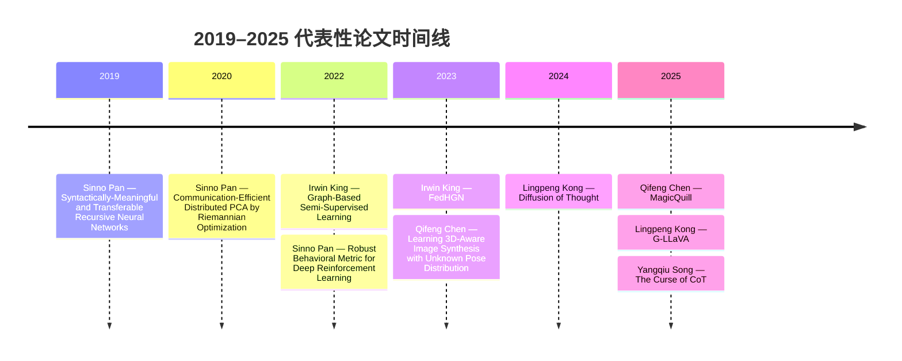

# 港校三强计算机视觉与大模型研究力量速览

## 执行摘要

基于截至 **2026 年 4 月 23 日** 可公开检索的官方院系主页、实验室主页、公开 Google Scholar 页面、DBLP、arXiv 以及近年顶会/期刊记录，我在三校中抽取了 **18 位“高相关核心样本”**（并在后文另外纳入少数未展开制表但影响力极高的 senior leaders）做对比。整体结论很清楚：**CUHK 的资深 AI/CV 基座最厚，HKUST 在多模态基础模型、LLM 推理与知识图谱方向的增量最强，HKU 的队伍更紧凑，但在生成视觉、具身/强化学习与 LLM 推理上上升很快。** citeturn14search1turn14search3turn15view2turn33view0turn34view1turn10view0turn41search18turn39search17

如果按方向选组而不是按学校名气选，结论大致是：**CV/多模态生成** 看 **CUHK + HKUST**；**NLP/LLM/知识图谱/Agentic AI** 看 **HKUST + HKU**；**医学影像/AI4S** 看 **CUHK 明显占优**；而 **RL** 在三校“核心 CS roster”里都不是最厚的一层，更多是嵌入在具身智能、机器人或 LLM agent 场景里。这个判断既来自官方研究兴趣，也来自 2023–2025 公开论文与项目分布。 citeturn15view2turn19search1turn33view0turn35view0turn35view2turn35view4turn39search16

下文表格里，**论文题后引文可点击到原文或官方记录页**；**Google Scholar h-index 只在公开 Scholar 页直接可见时填写**，其余统一记为“未指定”。

## 方法与范围

本报告优先使用以下来源：**官方大学/院系 faculty 页面、实验室主页、HKUST Faculty Profiles、Google Scholar 公共档案、DBLP、arXiv、ACL Anthology、CVPR/ICCV/NeurIPS/ICML/OpenReview 等会议或期刊记录**。这也是我建议你后续做更细粒度尽调时继续优先看的主源。 citeturn15view2turn16view0turn18view0turn34view1turn33view0turn13search1turn37search1

为保持简洁，我没有试图做三校“全员普查”，而是抽取了 **与题设标签最相关、且公开信息完整度较高** 的核心 PI/faculty 样本；**统计口径均基于本文表格样本**，因此适合做“方向与导师地图”，不适合直接当作官方 faculty census。对少数影响力极高但公开页面较难机读出近作/邮件的 senior faculty（如部分 MMLab 系 senior leaders），我在后文 shortlist 中单列。  

## HKU

HKU 在本文样本里呈现出一种“**小而锋利**”的结构：一端是 **Ping Luo / Hengshuang Zhao** 主导的生成视觉、具身智能与 3D/CV 线，另一端是 **Lingpeng Kong / Qi Liu** 的 **NLP、LLM、推理与形式化方向**；中间再由 **Dong Xu** 把医学影像/视觉/模式识别接上。相比 CUHK、HKUST，HKU 的覆盖面略窄，但上升速度很快。 citeturn10view0turn11search0turn41search18turn13search1turn39search17

| 姓名                                                     | 职称 / 院系                                            | 研究标签                        | 代表近作（≤3）                                                                                                                                                                                                                                         | 关键项目 / 角色                             | 联系方式          | 主页 / 实验室                   | GS h-index / 核验                                                                                  |
| ------------------------------------------------------ | -------------------------------------------------- | --------------------------- | ------------------------------------------------------------------------------------------------------------------------------------------------------------------------------------------------------------------------------------------------ | ------------------------------------- | ------------- | -------------------------- | ------------------------------------------------------------------------------------------------ |
| entity["people","Dong Xu","hku professor"]          | 教授 / 计算与数据科学学院（Computer Science）                   | CV, ML, DL, AI4S, others    | *Deep Active Shape Model for Automatic 3D Brain Structure Segmentation in MRI*；*Q2T: Query and Topic Guided Few-Shot Visual Symptom Recognition*；*SegPrompt: 3D Segmentation with Point Prompts using Foundation Models*                         | 医学影像、模式识别、计算机视觉                       | dongxu@hku.hk | 官方主页                       | 未指定。 citeturn11search0                                                                        |
| entity["people","Ping Luo","hku researcher"]        | 副教授 / 计算与数据科学学院                                    | CV, ML, LLM, DL, RL, others | *Closed-Loop Visuomotor Control with Generative Expectation for Robotic Manipulation*（NeurIPS 2024）；*FeedEdit: Text-Based Image Editing with Dynamic Feedback Regulation*（CVPR 2025）；*A Generative Foundation Model for Chest Radiography*（2025） | HKU 数据科学研究院副主任；HKU–上海 AI Lab 联合实验室副主任 | 未指定           | MMLAB@HKU / 相关实验室主页        | 47。 citeturn41search18turn41search6turn41search10turn41search14turn42search6              |
| entity["people","Hengshuang Zhao","hku cv scholar"] | 助理教授 / 计算与数据科学学院                                   | CV, ML, DL, others          | *Mod-Squad*（CVPR 2023）；*ScribbleSeg*（2023）；*VideoAnydoor*（2025）                                                                                                                                                                                  | 3D/分割/多模态视觉新生代 PI                     | 未指定           | 官方 faculty 主页              | 未指定。 citeturn10view0turn13search0turn13search4turn13search12                               |
| entity["people","Lingpeng Kong","hku nlp scholar"]  | 未指定 / HKU 相关 AI 页面公开档案显示为 HKU + Google DeepMind 关联 | NLP, ML, LLM, DL, others    | *Diffusion of Thought*（NeurIPS 2024）；*G-LLaVA*（ICLR 2025）；*Non-myopic Generation of Language Models for Reasoning and Planning*（2024）                                                                                                            | LLM 推理、形式化/几何题、多智能体与扩散式语言模型           | 未指定           | HKU AI 页面 / Scholar / DBLP | 56。 citeturn39search17turn13search1turn13search5turn13search9turn13search13turn42search2 |
| entity["people","Qi Liu","hku nlp scholar"]         | 助理教授 / 计算与数据科学学院                                   | NLP, ML, LLM, others        | *Unveiling Differences in Generative Models: A Scalable Differential Clustering Approach*（CVPR 2025）；其余未指定                                                                                                                                       | 大规模数据挖掘、信息检索、NLP                      | 未指定           | 官方 faculty 主页              | 未指定。 citeturn10view0turn42search23                                                           |

**HKU 的判断**：如果你关心 **生成视觉 + Embodied / RL** 或 **LLM 推理 / 形式化**，HKU 的“单位面积产出”很高；但若看 **AI4S、医学 AI、资深大组密度**，它目前仍弱于 CUHK。 citeturn41search18turn13search13turn19search1

## CUHK

CUHK 仍然是三校里**资深 AI bench 最厚**的学校。官方 faculty 页面与 MMLab 相关页面一起看，会发现它在 **CV、DL、医学影像、推荐/图学习、迁移学习、AI4S** 上都能拉出完整梯队；尤其是 **MMLab 脉络**（Xiaogang Wang / Dahua Lin / Hongsheng Li 等）对香港地区的 CV 生态仍然有最强的历史影响力。 citeturn14search1turn14search3turn14search11turn15view2

| 姓名                                                         | 职称 / 院系                             | 研究标签                     | 代表近作（≤3）                                                                                                                                                                                                                                                          | 关键项目 / 角色                                                  | 联系方式                     | 主页 / 实验室         | GS h-index / 核验                                                                                   |
| ---------------------------------------------------------- | ----------------------------------- | ------------------------ | ----------------------------------------------------------------------------------------------------------------------------------------------------------------------------------------------------------------------------------------------------------------- | ---------------------------------------------------------- | ------------------------ | ---------------- | ------------------------------------------------------------------------------------------------- |
| entity["people","Irwin King","cuhk ai scholar"]         | 教授 / CSE                            | ML, DL, NLP, others      | *A Survey on Deep Semi-Supervised Learning*（TKDE 2023）；*FedHGN*（IJCAI 2023）；*Graph-Based Semi-Supervised Learning*（TNNLS 2022）                                                                                                                                    | Pro-Vice-Chancellor；MISC Lab 主任；ELITE 主任；KEEP/VeriGuide PI | king@cse.cuhk.edu.hk     | 个人主页 / MISC Lab  | 96。 citeturn16view0turn26search0                                                              |
| entity["people","Sinno Jialin Pan","transfer learning"] | 教授 / CSE                            | ML, DL, NLP, RL, others  | *On Acceleration for Convex Composite Minimization...*（JMLR 2022）；*Learning Representations via a Robust Behavioral Metric for Deep Reinforcement Learning*（NeurIPS 2022）；*Variational Deep Logic Network for Joint Inference of Entities and Relations*（CL 2021） | IEEE Fellow；TPAMI/AIJ/TIST 编委                              | sinnopan@cse.cuhk.edu.hk | 个人主页             | 60。 citeturn18view0turn25search1                                                              |
| entity["people","Qi Dou","cuhk med ai"]                 | 副教授 / CSE                           | CV, ML, DL, AI4S, others | *Contrastive Cross-Site Learning With Redesigned Net for COVID-19 CT Classification*（2021）；其余未指定                                                                                                                                                                  | 医疗 AI、手术数据科学、机器人；附属多个医学机器人/医疗智能平台                          | qdou@cse.cuhk.edu.hk     | 个人主页             | 未指定。 citeturn19search1turn27search23                                                          |
| entity["people","Weiyang Liu","cuhk ml scholar"]        | 助理教授 / CSE                          | CV, ML, DL, LLM, others  | *Reparameterized LLM Training via Orthogonal Equivalence Transformation*（2025）；*Verbalized Machine Learning*（TMLR 2025）；*MetaMath*（ICLR 2024）                                                                                                                     | SphereLab 主任；生成式 AI / Foundation Models / LLM              | wyliu@cse.cuhk.edu.hk    | 个人主页 / SphereLab | 未指定。 citeturn17view2                                                                           |
| entity["people","Liwei Wang","cuhk vision language"]    | 助理教授 / CSE                          | CV, NLP, ML, DL, LLM     | *Beyond Embeddings: The Promise of Visual Table in Visual Reasoning*（EMNLP 2024）；*Enhancing Temporal Modeling of Video LLMs via Time Gating*（EMNLP 2024）；*CLEVA*（EMNLP 2023 Demo）                                                                                 | LaVi（Language & Vision）团队负责人                               | lwwang@cse.cuhk.edu.hk   | 个人主页 / LaVi      | 未指定。 citeturn17view0turn26search12                                                            |
| entity["people","Hongsheng Li","cuhk cv scholar"]       | 教授 / Electronic Engineering / MMLab | CV, ML, DL, others       | *UniFormer: Unifying Convolution and Self-Attention for Visual Recognition*（TPAMI 2023）；*Transformer-based deep learning for accurate detection of...*（2025）；其余未指定                                                                                                | CUHK 年轻学者奖；Smart Traffic Fund 项目；NSFC/RGC 联合资助             | hsli@ee.cuhk.edu.hk      | 个人主页 / MMLab     | 129。 citeturn23search0turn25search3turn25search7turn25search21turn25search23turn23search9 |
| entity["people","Shengchao Liu","cuhk ai4s scholar"]    | 助理教授 / CSE                          | ML, DL, AI4S, others     | *Rigidity-Aware Geometric Pretraining for Protein Design*（2026 预印本，接近 AI4S 主线）；其余未指定                                                                                                                                                                              | 官方 faculty 页面明确列为 “AI for Science, Science for AI”         | scliu@cse.cuhk.edu.hk    | 官方 faculty 主页    | 未指定。 citeturn15view2turn19search0turn27search9                                               |

**CUHK 的判断**：如果你想找 **老牌 CV/视觉大组、医学 AI/AI4S、GNN/推荐/迁移学习**，CUHK 的导师选择最“厚”，而且 senior leadership 最集中。本文未展开制表但**必须额外关注**的 senior leaders 还包括 **entity["people","Xiaogang Wang","cuhk vision leader"]** 与 **entity["people","Dahua Lin","cuhk mmlab leader"]**。前者是 CUHK 电子工程与视觉方向的代表性教授，后者是 MMLab 核心领导者之一，并在校内外 AI 产业化与联合实验室建设中极具影响力。 citeturn22search0turn25search6turn14search1turn14search11turn15view2

## HKUST

HKUST 的公开画像最鲜明：**Qifeng Chen、Yangqiu Song、Yi R. Fung、Long Chen** 这条线，把 **多模态基础模型、视觉生成、知识图谱、LLM 推理、语言 agent、RAG、多模态鲁棒性** 串成了很完整的“下一代模型栈”；再叠加 **James T. Kwok、Bo Li** 的 ML / 系统 / big data 基座，整体上非常像一个面向 foundation models 的增长型组合。 citeturn34view1turn33view0turn36view3turn36view0turn30search0turn34view0

| 姓名                                                     | 职称 / 院系                                   | 研究标签                    | 代表近作（≤3）                                                                                                                                                                                                                                                                                                    | 关键项目 / 角色                                                                       | 联系方式            | 主页 / 实验室           | GS h-index / 核验                                                          |
| ------------------------------------------------------ | ----------------------------------------- | ----------------------- | ----------------------------------------------------------------------------------------------------------------------------------------------------------------------------------------------------------------------------------------------------------------------------------------------------------- | ------------------------------------------------------------------------------- | --------------- | ------------------ | ------------------------------------------------------------------------ |
| entity["people","Qifeng Chen","hkust cv scholar"]   | 副教授 / CSE, ECE, Arts & Machine Creativity | CV, ML, DL, others      | *MagicQuill*（CVPR 2025）；*MangaNinja*（CVPR 2025）；*Learning 3D-Aware Image Synthesis with Unknown Pose Distribution*（CVPR 2023）                                                                                                                                                                               | Center for AI Research 代理主任；AoE 老年护理 AI/机器人项目；DeepSparseCT CRF 项目               | cqf@ust.hk      | 个人主页               | 66。 citeturn34view1turn36view5turn36view6turn35view0turn41search1 |
| entity["people","Yangqiu Song","hkust kg nlp"]      | 副教授 / CSE, Mathematics                    | NLP, ML, LLM, others    | *Learning Federated Neural Graph Databases for Answering Complex Queries from Distributed Knowledge Graphs*（TMLR 2025）；*The Curse of CoT*（TMLR 2025）；*Wasserstein Graph Neural Networks for Graphs With Missing Attributes*（TPAMI 2025）                                                                     | HKUST-WeBank Joint Lab 副主任；华为/腾讯/RGC 多个 KG+LLM 项目；HKGAI 参与者                     | yqsong@ust.hk   | 个人主页 / KnowComp 方向 | 65。 citeturn33view0turn35view2turn40search2turn40search6           |
| entity["people","Yi R. Fung","hkust llm scholar"]   | 助理教授 / CSE                                | NLP, ML, LLM, others    | *Let’s Reason Formally*（EMNLP 2025）；*MMBoundary*（ACL 2025）；*Persona-DB*（ACL 2025）                                                                                                                                                                                                                           | 多语 LLM 持续学习项目；BYD 自监督鲁棒语音分离项目                                                   | yrfung@ust.hk   | 个人主页               | 未指定。 citeturn36view3turn34view3turn35view4turn37search1            |
| entity["people","Long Chen","hkust multimodal"]     | 助理教授 / CSE                                | CV, ML, DL, LLM, others | *Open-World Multimodal Understanding and Generation with Efficiently Finetuned Foundation Models*（AAAI 2025）；*SpA2V*（ACM MM 2025）；*Ref-NMS*（AAAI 2021）                                                                                                                                                      | NSFC“可解释跨模态理解”；RGC“可控可编辑多模态基础模型”；开放场景组合视觉理解                                     | longchen@ust.hk | 个人主页               | 未指定。 citeturn36view0turn34view4turn35view3                          |
| entity["people","James T. Kwok","hkust ml scholar"] | 教授 / CSE                                  | ML, DL, others          | *End-to-End Optimization for Multimodal Retrieval-Augmented Generation via Reward Backpropagation*（EMNLP Findings 2025）；*Revitalizing Canonical Pre-Alignment for Irregular Multivariate Time Series Forecasting*（2025）；*Searching to Exploit Memorization Effect in Learning with Noisy Labels*（ICML 2020） | 风险管理与商业智能项目联合主任；长期 ML/核方法核心教授                                                   | jamesk@ust.hk   | 个人主页               | 未指定。 citeturn30search0turn38search2turn37search0turn30search4      |
| entity["people","Bo Li","hkust ml systems"]         | 讲座教授 / CSE                                | ML, LLM, others         | *Mitigating Server-Side Communication Bottlenecks in Distributed Learning...*（2026）；其余未指定                                                                                                                                                                                                                   | Big Data Institute 主任；HKUST–Alibaba Big Data and AI 联合实验室主任；可信 LLM 集成应用 CRF 参与者 | bli@ust.hk      | 官方 faculty profile | 未指定。 citeturn34view0turn35view1                                      |

**HKUST 的判断**：如果你的核心兴趣是 **多模态 foundation models、知识图谱 + LLM、agentic AI、RAG、模型鲁棒性、ML systems**，HKUST 是三校里最“顺手”的目的地。相对而言，**AI4S 在核心 CSE roster 中不如 CUHK 明显**，但它把 AI 向机器人、金融科技、智慧城市与系统方向的扩展做得更系统。 citeturn35view0turn35view2turn35view4turn35view1

## 综合比较与优先名单

### 字段计数

下表按**本文 18 位样本**人工打标签统计，反映的是“公开可见核心阵容”的形状，而不是全校 faculty 总数。

| 领域标签   | HKU | CUHK | HKUST | 合计  |
| ------ | ---:| ----:| -----:| ---:|
| CV     | 3   | 4    | 2     | 9   |
| NLP    | 2   | 3    | 2     | 7   |
| ML     | 5   | 7    | 6     | 18  |
| LLM    | 3   | 2    | 4     | 9   |
| DL     | 4   | 7    | 3     | 14  |
| RL     | 1   | 1    | 0     | 2   |
| AI4S   | 1   | 2    | 0     | 3   |
| others | 0   | 4    | 6     | 10  |

这个计数说明了三点：**ML/DL 是三校共同底盘；LLM 在 HKUST/HKU 更集中；AI4S 最集中在 CUHK。**  

### Venn 风格重叠比较

从“学校覆盖的标签集合”看，**三校共同交集** 是 **CV、NLP、ML、LLM、DL**。在本文样本里，**HKU ∩ CUHK** 还共享了 **RL/具身延伸**；**CUHK 唯一明显更强的补集** 是 **AI4S/医学影像/手术数据科学**；而 **HKUST 的相对特色补集** 则是 **知识图谱、agentic LLM、RAG、多模态 foundation model 工程化**。这一点与三校公开项目组合高度一致。 citeturn19search1turn27search9turn35view0turn35view2turn35view4turn41search18

### 优先短名单

下面这个 **Top 10** 不是“论文数排行”，而是综合了 **学术影响、引文体量、实验室/项目领导力、以及 2023–2025 的公开活跃度** 后的优先名单。

| 优先级 | 学者                                                          | 学校    | 简短理由                                                                                                                                     |
| --- | -----------------------------------------------------------:| ----- | ---------------------------------------------------------------------------------------------------------------------------------------- |
| 1   | Hongsheng Li                                                | CUHK  | 公开 Scholar 档案显示引文体量极大、h-index 129；同时兼具 CV 主线、MMLab 影响力与持续项目/资助。 citeturn25search3turn23search0turn23search9                         |
| 2   | Irwin King                                                  | CUHK  | ACM/IEEE/AAAI/INNS Fellow，h-index 96；学校级 leadership、MISC/ELITE/KEEP 多重平台叠加。 citeturn16view0turn26search0                             |
| 3   | Xiaogang Wang                                               | CUHK  | 香港 CV 生态关键奠基者之一；官方页面与校方报道均显示其在视觉学术声望和行业影响上处于第一梯队。 citeturn22search0turn25search6turn22search17                                      |
| 4   | Dahua Lin                                                   | CUHK  | MMLab 核心领导者之一，学校官方专题明确将其放在 CUHK AI 核心人物位置；兼具学术与产业化领导力。 citeturn14search1turn14search11turn15view2                                   |
| 5   | Qifeng Chen                                                 | HKUST | HKUST AI Research Center 代理主任，视觉生成与 3D/编辑方向近年极强，公开 Scholar h-index 66。 citeturn31search0turn41search1                                |
| 6   | Sinno Jialin Pan                                            | CUHK  | Transfer Learning 旗帜人物，IEEE Fellow，h-index 60；ML/NLP/RL 三线都能带。 citeturn18view0turn25search1                                          |
| 7   | Yangqiu Song                                                | HKUST | KG + LLM + NLP 组合最完整的香港本地一线 PI 之一，公开 Scholar h-index 65，项目密度很高。 citeturn33view0turn35view2turn40search2                             |
| 8   | Ping Luo                                                    | HKU   | HKU 生成视觉/具身智能路线的最强节点之一，h-index 47，且兼具 HKU IDS 与联合实验室 leadership。 citeturn41search18turn41search6                                     |
| 9   | Lingpeng Kong                                               | HKU   | LLM 推理、扩散语言模型、形式化与多模态方向高活跃；公开 Scholar h-index 56，且有 HKU + DeepMind 双重信号。 citeturn42search2turn13search5turn13search9turn13search13 |
| 10  | entity["people","Dit-Yan Yeung","hkust chair professor"] | HKUST | 长期 ML/AI 核心 senior leader；官方页面显示其为 Chair Professor，研究横跨 ML、CV、推荐与教育应用。 citeturn29search0turn34view2                                  |

**一句话结论**：  

- **重 CV / 医疗视觉 / 大组资源**：优先看 **CUHK**。  
- **重大模型 / agent / KG / 多模态 foundation models**：优先看 **HKUST**。  
- **想在较小但成长快的队伍里押生成视觉、具身智能或 LLM 推理**：优先看 **HKU**。  

## 发表时间线

下面时间线选取了 **Irwin King、Sinno Jialin Pan、Qifeng Chen、Lingpeng Kong、Yangqiu Song** 五位在本文中“近作可见度 + 影响力”都比较高的学者。时间线中的论文节点均来自其官方主页、faculty profile、DBLP 或公开 Scholar/论文记录。 citeturn16view0turn18view0turn34view1turn13search5turn13search9turn13search13turn33view0

## 局限与开放问题

这份报告有三点需要你在使用时注意。第一，**计数与比较是基于本文“核心样本”而非三校全体 faculty census**；第二，部分官方页面没有公开个人邮箱、近三年精选论文或公共 Scholar 指标，因此按照你的要求统一标为 **“未指定”**；第三，对少数 senior leaders（尤其是部分 MMLab 系人物），**公开页面更强调荣誉/平台而不是机器可读的近作列表**，因此他们在 shortlist 中的重要性高于其在表格中的信息完整度。  

如果你下一步是做 **申请 / 合作 / 招聘** 级别的筛选，建议把 shortlist 前 10 位再做一轮更细的 **“近三年学生去向 + 经费持续性 + 一作/共同作者网络 + 是否收学生”** 尽调。

# 香港及大湾区人工智能核心研究生态的全景深度解析：基于港大、港中大、港科大在CV、NLP、LLM、RL与AI4S领域的顶尖学者与学术脉络

## 引言：处于全球技术重构中心的大湾区人工智能科研矩阵

在全球人工智能（AI）领域经历从传统深度学习（Deep Learning）向多模态大模型（Large Multimodal Models）、通用智能智能体（Autonomous Agents）以及人工智能驱动科学发现（AI for Science, AI4S）的范式演进之际，香港的顶尖学术机构已确立了其作为全球前沿技术创新核心枢纽的地位。香港大学（HKU）、香港中文大学（CUHK）以及香港科技大学（HKUST及HKUST-GZ）不仅在理论计算机科学的底层算法上持续输出具有定义性意义的研究成果，更在计算机视觉（CV）、自然语言处理（NLP）、强化学习（RL）、机器学习（ML）基础理论以及大型语言模型（LLM）的垂直领域应用中，展现出了无可比拟的生态协同效应。

根据最新的全球学术影响力指标体系（包括斯坦福大学全球前2%顶尖科学家榜单、AI 2000全球人工智能学者榜单以及ACM/IEEE会士评选），这三所学府的学者在决定现代AI发展轨迹的关键子领域中占据了主导地位。当前的科研焦点已显著超越了早期追求单纯参数量扩展的阶段，转而深入探究“白盒”（White-Box）可解释性AI架构的数学本质、生成式流网络（GFlowNets）在复杂决策中的应用、长跨度任务智能体（Long-Horizon Agents）的泛化能力，以及医疗、化学、物理、金融等垂直领域的知识对齐。

本报告旨在提供一份详尽、多维度、全景式的深度研究分析。通过对港大、港中大、港科大三所高校的核心科研中心、顶尖专家学者及其最新（2024-2026年）学术出版物和基础设施的系统性梳理，本报告将揭示大湾区人工智能科研的内在逻辑、因果关联、技术转移路径及其对未来全球技术格局的深远影响。

---

## 一、 香港大学（HKU）：“白盒”可解释性理论、生成式智能体与生物计算（BioAI）的创新策源地

香港大学在人工智能领域的战略布局呈现出强烈的跨学科特征与底层理论突破导向。通过近期成立的计算与数据科学学院（School of Computing and Data Science）、HKU Musketeers Foundation数据科学研究院（HKU IDS）以及人工智能、管理与组织研究中心（CAMO），港大成功打破了传统计算机科学与生物学、管理学、经济学之间的壁垒。其目前的科研轨迹在三个维度上极为突出：深度神经网络的可解释性重构、自主大型语言模型智能体系统的开发，以及生物医疗人工智能（BioAI）的深度工业化。

### 1.1 计算机视觉（CV）与底层深度学习理论：从黑盒走向“白盒”

在深度学习模型日益复杂化且伴随“黑盒”不可解释性风险的背景下，港大在重构神经网络数学基础上发挥了引领作用。

**马毅教授（Yi Ma）** 是这一理论革命的核心人物。他的近期研究对高度依赖海量参数和试错机制的传统深度学习架构提出了根本性挑战。基于简约性（Parsimony）与自洽性（Self-Consistency）原则，马毅教授提出并深化了最大编码率折算（Maximal Coding Rate Reduction）理论与“白盒”Transformer架构（White-Box Transformers）。他在闭环转录（Closed-Loop Transcription）、卷积稀疏编码（Convolutional Sparse Coding）以及ReduNet等方面的突破性贡献，为特征表征学习提供了严谨的数学框架。这一范式转移意味着，未来的视觉与智能系统将能够基于透明、闭环的优化原则自发涌现智能，而非依赖不可解释的参数堆砌。

在生成式视觉与深度强化学习领域，**罗平副教授（Ping Luo）** 是极具全球影响力的领军学者。在AI 2000计算机视觉领域排名第58位的罗教授，目前担任港大与上海人工智能实验室联合研究中心的副主任。他的研究组在超高分辨率生成式AI、模型压缩与具身智能（Embodied AI）领域产出了大量顶级成果。罗教授在2024年发表的代表作包括用于4K文本到图像生成的弱到强扩散Transformer模型（*PixArt-Σ*）、用于大型语言模型的全方位校准量化架构（*OmniQuant*），以及关注区域理解的视觉语言模型（*RegionGPT*）。这些研究不仅提升了生成质量，更通过量化技术显著降低了LLM在端侧设备部署的计算成本，揭示了从云端向边缘计算转移的行业趋势。

此外，港大在计算机视觉、图形学与可视化领域汇聚了庞大的顶尖专家矩阵。**俞益洲教授（Yizhou Yu）** 在全球可视化领域高居第36位，领导着AI、机器人与视觉计算研究组。**赵恒爽教授（Hengshuang Zhao）** （计算机视觉排名第79）则在3D/4D场景理解与点云向量化（Point Cloud Vectorization）方向上推动了自动驾驶与空间计算的基础研究。此外，**高胜华教授（Shenghua Gao）** 专注于具备真实光影与几何校正的3D/4D生成；**韩开教授（Kai Han）** 致力于几何感知与物理基础的动态3D场景建模；而**Taku Komura教授**（图形学全球排名第46）和**Kenneth K.Y. Wong教授** 也在视觉图形学领域提供了深厚的理论支撑。

### 1.2 自然语言处理（NLP）、LLM智能体（Agents）与复杂图学习

港大的自然语言处理生态系统已经完成了从静态文本生成向自主、多模态智能体（Autonomous Agents）构建的全面转型。这一转变深刻反映了AI系统正从“聊天工具”演变为“行动者”的行业轨迹。

**孔令鹏助理教授（Lingpeng Kong）** 的研究轨迹完美地映射了这一演进。早期在句法结构蒸馏和循环神经网络语法方面的杰出工作奠定了他的理论基础，而他近期的研究则完全聚焦于在真实数字环境中运行的语言智能体。其2024年的重磅工作《OpenAgents: An Open Platform for Language Agents in the Wild》以及《Lemur: Harmonizing Natural Language and Code for Language Agents》构建了开源的智能体交互平台，赋予了LLM执行代码、调用工具以及通过动作学习进行复杂推理的能力。

在语义解析和智能体评测领域，**余涛助理教授（Tao Yu）** 的贡献极具开创性。余涛教授早年主导的*Spider*数据集（用于复杂及跨域语义解析和Text-to-SQL任务的大规模人工标注数据集）彻底重塑了机器与结构化数据库交互的标准。当前，他正致力于构建更为复杂的评估基准，如2024年发表的《OSWorld: Benchmarking Multimodal Agents for Open-Ended Tasks in Real Computer Environments》，该工作直接针对多模态智能体在真实计算机操作系统中执行开放式任务的能力进行了基准测试。

在基础数据挖掘与信息检索领域，**黄超助理教授（Chao Huang）** （AI 2000数据挖掘领域排名第48，检索与推荐领域排名第83）主导了数据智能实验室的工作。他的研究处于LLM、图基础模型（Graph Foundation Models）与检索增强生成（RAG）的交叉点。其开源项目如*LightRAG*、*GraphGPT*及针对智慧城市的*UrbanGPT*，极大地推动了LLM在处理高度结构化关系网络时的逻辑准确性。

此外，在系统评估层面，由香港大学商学院**Jack Jiang教授** 领导的人工智能评估实验室对中美主流大语言模型的复杂推理能力进行了深度拆解。其近期发布的报告指出，AI的发展已从追求全场景覆盖的“广度”转向垂直领域的“推理深度”，尤其在多模态理解与奥林匹克级别的数学推理上出现了明显的分层。在基础理论方面，**Zhiyi Huang教授**（计算理论排名第85）、**Reynold C.K. Cheng教授**（数据库排名第62）以及**Benjamin C.M. Kao教授** 等学者为大语言模型背后的数据工程及算法复杂性提供了底层支撑。

### 1.3 AI for Science (AI4S) 与医疗生物人工智能（BioAI）

港大深刻意识到AI在驱动科学范式变革中的潜力，设立了专门的生物医疗人工智能（BioAI）实验室，将其作为连接计算科学与生命科学的桥梁。

**罗睿邦副教授（Ruibang Luo）** 担任BioAI实验室的带头人，他的专长在于利用先进的机器学习算法解决生物信息学及基因组学中的海量数据解析问题。在医疗影像与病理分析方向，**瞿良琼教授（Liangqiong Qu）** 正致力于开发基于多模态术前数据的早期中枢神经系统肿瘤诊断视觉语言基础模型。同时，**余乐权教授（Lequan Yu）** 的研究则通过将临床相关先验知识融入病理学基础模型中，实现对软组织肉瘤的精准诊断与预后评估。此外，**Zhenqin Wu教授**在多重成像方法及应用领域也推进了重要工作。

在更广泛的机器学习基础理论方面，**Difan Zou教授** 正深入探索扩散模型（Diffusion Models）的推理基础与分数学习算法理论；**Yuan Cao教授** 聚焦于在少量标注数据下的深度学习算法与理论基础；而**Jian Qian教授**、**Yingyu Liang教授**等也在模型优化和统计学习理论层面为AI4S的发展夯实了基础。

### 表1：香港大学（HKU）核心AI学者及科研布局概览

| **学者姓名**                | **核心子领域**    | **近期重点研究方向与标志性贡献**                                    | **依托机构/实验室**            |
| ----------------------- | ------------ | ----------------------------------------------------- | ----------------------- |
| **Yi Ma (马毅)**          | 深度学习理论与CV    | “白盒”Transformer、最大编码率折算、闭环转录架构的数学基础。                  | 计算与数据科学学院               |
| **Ping Luo (罗平)**       | 生成式视觉与RL     | 扩散Transformer (PixArt)、LLM全方位校准量化 (OmniQuant)、具身智能模型。 | HKU IDS / 上海AI实验室联合研究中心 |
| **Lingpeng Kong (孔令鹏)** | NLP与语言智能体    | 构建野生环境下的语言智能体开源平台 (OpenAgents)、代码与自然语言对齐。             | 计算机科学系                  |
| **Tao Yu (余涛)**         | 语义解析与大模型评估   | Text-to-SQL标杆 (Spider)、多模态智能体系统级操作基准测试 (OSWorld)。     | 计算机科学系                  |
| **Chao Huang (黄超)**     | 数据挖掘与图学习     | 图基础模型 (GraphGPT)、轻量级检索增强生成 (LightRAG)、智慧城市LLM。        | 数据智能实验室                 |
| **Ruibang Luo (罗睿邦)**   | 临床基因组学与BioAI | 生物信息学中的深度学习算法、医学序列数据解析。                               | BioAI实验室                |
| **Yizhou Yu (俞益洲)**     | 可视化与图形学      | 全球可视化领域排名#36，医学图像与视觉计算基础研究。                           | AI、机器人与视觉计算组            |

---

## 二、 香港中文大学（CUHK）：具身智能、多模态开源生态与基础优化的领航者

香港中文大学（CUHK）在计算机视觉、深度学习优化理论以及医疗机器人领域拥有世界上最为深厚且最具传承性的学术底蕴。港中大通过交叉学科人工智能研究所（IAIRI）、中大放射学AI实验室（CLAIR）以及港中大（深圳）人工智能学院等战略平台，不仅在基础理论上持续突破，更在开源生态系统建设和医疗科学的交叉应用上构筑了极高的行业壁垒。

### 2.1 计算机视觉巨擘：多模态大模型（LMM）与开源基础设施的统治力

港中大的计算机视觉生态之所以具有极高的全球影响力，很大程度上归功于其对开源工具链及评测基准的持续贡献。

**林达华副教授（Dahua Lin）** 是这一领域的标志性人物。他主导开发的**OpenMMLab**工具库（包含MMDetection、MMSegmentation等）已成为全球计算机视觉研究不可或缺的基础设施。在LLM崛起后，林教授的重点迅速转向大型多模态模型（LMMs）。在2024至2025年间，他带领团队推出的*InternVL*及*InternVL3*系列模型，旨在通过探索先进的训练与测试期计算（test-time scaling）配方，打破开源模型与闭源商业巨头（如GPT-4V）之间的性能壁垒。其研究同时深刻涉及基于骨架的动作识别（通过时空图卷积网络）、视频生成（VBench）及多模态基准测试平台。

在具身智能（Embodied AI）与生成式视觉方向，**李鸿升副教授（Hongsheng Li）** 展现了惊人的学术生产力与创新深度。作为连续入选AI 2000榜单及斯坦福顶尖科学家行列的学者，其团队仅在ICLR 2025和CVPR 2025就分别有15篇和11篇论文被接收。李教授的研究致力于将深层视觉表征与机器人物理环境交互相融合，其近期的探索包括高保真可编辑自动驾驶模拟器、机器人操作合成视频以及占据网格感知的3D轨迹预测等。这种将视觉感知直接转化为物理世界动作指令的能力，是迈向通用机器人技术的关键。

港中大CV阵营还汇聚了众多殿堂级学者，包括IEEE/ACM双料会士**Jiaya Jia教授**（在计算机视觉及语言领域具有极深造诣）、**Chi Wing Fu教授**（专注于AR/VR、计算机图形学）、以及专注于深度学习与底层视觉特征提取的**Jackey Cheung** 和 **Xiao Liang** 等人。

### 2.2 机器学习根基与强化学习（RL）算法的数学推演

在机器学习与优化理论的深水区，港中大的学者在强化学习、迁移学习与分布式计算机制上做出了诸多定义域级别的贡献。

**潘嘉林教授（Sinno Jialin Pan）** 在迁移学习（Transfer Learning）与领域自适应（Domain Adaptation）方向是公认的先驱。他早期关于迁移分量分析（TCA）的研究使得在数据稀缺目标域上部署高精度模型成为可能。他目前的科研阵地已推进至深度强化学习中的表征鲁棒性、对抗性特征学习以及存在梯度噪声条件下的凸复合最小化（Convex Composite Minimization）算法研究。这些数学推演对于提高RL智能体在动态、嘈杂环境下的收敛稳定性至关重要。

中大计算机科学与工程学系卓敏讲座教授、ACM/IEEE会士**John Chi Shing Lui教授**，领导着高级网络与系统研究实验室（ANSRLab）。他将在线学习理论、多臂老虎机（Multi-Armed Bandits, MAB）及强化学习机制创新性地引入至网络科学、海量数据分析乃至前沿的量子互联网（Quantum Internet）路由与分布式量子计算领域。

作为年轻一代生成式AI的代表，**Weiyang Liu助理教授** 领导了SphereLab。他在参数高效微调（如基于蝴蝶分解的直交微调技术）、重参数化LLM训练（Reparameterized LLM Training）及大语言模型引导的自我数学推演（MetaMath）方面的工作，极大推动了LLM训练的资源效率与逻辑内化能力。

此外，在中大庞大的ML/AI基础团队中，还包括**Yu Cheng副教授**、**Farzan Farnia助理教授**（深度学习理论）、**Irwin King教授**（机器学习与计算社会科学）、**Michael Rung Tsong Lyu教授**（软件工程与机器学习可靠性），以及专注于计算理论的**Bei Yu教授**和**Hong Cheng教授**（数据挖掘）。这一矩阵确保了从底层算法复杂性到上层工程实现的完整研究链路。

### 2.3 AI4S、医疗影像诊断与手术机器人技术的产业化

港中大在应用AI解决具体科学及临床难题（AI4S）上积累了极高壁垒。在医学人工智能层面，**Qi Dou副教授** 将深度学习、医学图像分析与机器人控制学相融合。她研发的手术具身智能系统（Surgical Embodied Intelligence）能够实现腹腔镜机器人辅助手术的泛化自主性操作。其多篇论文斩获MICCAI与MedIA最佳论文奖，确立了中大在智能手术工作流识别领域的国际领先地位。在更广泛的影像学应用上，中大医学院**Carol Cheung教授** 领衔的“Global RETFound”项目整合了全球一亿张眼部图像，训练出了世界首个具备全球代表性的医疗AI基础模型，突破了长期存在于医疗AI中的地理与种族数据偏差壁垒。此外，**Pheng Ann Heng教授** 长期致力于医疗虚拟现实（VR）与手术模拟系统的AI驱动创新。

在硬科学交叉领域，**Shengchao Liu助理教授** 在分子动力学、化学与物理学的AI建模（AI4S）中崭露头角。他专注于3D分子图表示学习与生成式建模。其近期发表的《InertialAR: Autoregressive 3D Molecule Generation with Inertial Frames》为染色体建模及分子生成提供了全新的分辨率无关的几何转换框架；同时，他还探索了使用LLM推理体系引导电池材料的发现与表征，将生成式语言模型的逻辑能力直接作用于材料科学的假说验证。

而在中大与上海人工智能实验室合办的IAIRI，由**Tianfan Xue教授**、**Wanli Ouyang教授** 等关联专家共同推动，目标是整合计算机视觉、自然语言处理与系统安全，构建能够服务于大规模疾病诊断与自然资源管理的多模态通用智能架构。香港中文大学（深圳）的**Haizhou Li院士**（语音处理与NLP巨擘）及**Shuguang Cui教授** 也为整体大湾区的泛认知与物联网AI做出了卓越贡献。

### 表2：香港中文大学（CUHK）核心AI学者及科研布局概览

| **学者姓名**                     | **核心子领域**    | **近期重点研究方向与标志性贡献**                     | **依托机构/实验室**        |
| ---------------------------- | ------------ | -------------------------------------- | ------------------- |
| **Dahua Lin (林达华)**          | CV与多模态大模型    | OpenMMLab体系、InternVL多模态系列、动作识别、模型缩放法则。 | 交叉学科人工智能研究所 (IAIRI) |
| **Hongsheng Li (李鸿升)**       | 具身智能与生成模型    | 机器人操作轨迹预测、自动驾驶多模态感知、高保真物理交互。           | 电子工程学系              |
| **Sinno Jialin Pan (潘嘉林)**   | 迁移学习与RL      | 领域自适应、深度强化学习表征鲁棒性、凸复合最小化算法。            | 计算机科学与工程学系          |
| **John Chi Shing Lui (吕自成)** | 在线学习与系统网络    | 多臂老虎机模型、强化学习在网络科学与量子路由中的应用。            | 高级网络与系统研究实验室        |
| **Weiyang Liu (刘威仰)**        | 语言大模型基础      | 参数高效直交微调、MetaMath数学推理引导机制、重参数化训练。      | SphereLab           |
| **Qi Dou (窦琪)**              | 医疗机器人与CV     | 腹腔镜自动手术具身智能系统、手术视频解析视觉基础模型。            | T-Stone机器人研究所       |
| **Shengchao Liu (刘盛超)**      | AI4S (化学/物理) | 自回归3D分子图生成 (InertialAR)、LLM引导电池材料发现。   | 计算机科学与工程学系          |
| **Jiaya Jia (贾佳亚)**          | 计算机视觉        | 图像与视频增强、场景解析、IEEE/ACM双料会士。             | 计算机科学与工程学系          |

---

## 三、 香港科技大学（HKUST & HKUST-GZ）：大模型对齐、强化学习优化与垂直领域（金融）AI的工业级落地

香港科技大学（含广州校区HKUST-GZ）的人工智能研究生态以极致的工程实现能力、系统架构设计以及与区域经济（如金融与智能制造）的高度耦合而著称。在CAiRE（人工智能研究中心）的统筹下，港科大的学者在应对当前大模型时代最严峻的挑战——如模型幻觉（Hallucination）、价值对齐（Value Alignment）、多智能体决策机制以及低延迟软硬件协同设计——展现出了全球顶级水准。

### 3.1 自然语言处理（NLP）、语音学与AI可信对齐

在当前LLM广泛部署的进程中，模型输出的不可靠性与道德对齐问题成为了行业痛点。港科大的NLP团队在解决这一问题上处于国际领先地位。

CAiRE主任、AAAI及ACL会士**Pascale Fung（冯雁）教授** 长期深耕于语音识别、机器翻译与跨语言信息处理。但面对生成式AI浪潮，她的研究迅速聚焦于解决LLM的内蕴缺陷。在2024-2025年的最新研究中，冯教授深入探究了大型语言模型中的高维跨语言表征机制以及人类价值观在高维空间的投射。更重要的是，她提出将“口头不确定性”（verbal uncertainty）校准为一个线性特征，以有效减少大模型在输出时的过度自信与幻觉现象（Hallucinations）。这种人类中心化且可信赖（Human-Centric Trustworthy）的AI架构，是确保AI在科学、医疗及社会科学领域应用安全性的关键防线。

与之互补，助理教授**Junxian He（何俊贤）** 的研究极大地拓展了语言智能体的认知与执行边界。他在2024-2025年发表的《AgentBoard: An Analytical Evaluation Board of Multi-turn LLM Agents》及《The Tool Decathlon》等工作，不仅评估了语言模型执行单轮问答的能力，更系统性地解析了LLM在多样化、真实且需长跨度决策（long-horizon task execution）环境中的工具调用与纠错能力。同时，**Brian Kan-Wing Mak副教授** 和 **Yi R. Fung助理教授** 等也在语音交互与自然语言逻辑推理方面做出了持续贡献。

### 3.2 强化学习（RL）、机器学习理论与复杂系统推演

港科大在强化学习与决策智能（Decision-Making）方向储备了极其硬核的数学与算法研究力量。

中科院自动化所背景、目前担任助理教授的**Ling Pan（潘玲）**，领导着智能决策实验室（Intelligent Decision-Making Lab）。她的研究深入探索了生成式流网络（Generative Flow Networks, GFlowNets）与深度强化学习机制。由于GFlowNets能够生成与奖励函数成正比的多样化高质量样本，潘教授在2025年的论文《Evolution guided generative flow networks》及《Flow Factorization for Efficient Generative Flow Networks》展示了利用这些高级决策算法解决计算可持续性难题、多智能体系统协同以及基础模型后训练（post-training of foundation models）的巨大潜力。这种机制特别适用于AI4S中需要探索广阔搜索空间的药物分子发现与材料生成。

资深学者、讲座教授**Dit-Yan Yeung（杨瓞仁）** （h指数64，被引超28000次）长期专注于多任务学习（Multitask Learning）、时空图神经网络（Spatiotemporal GNNs）及异常检测预测。他近期主导的研究项目通过深度学习中的自监督预训练与微调机制进行极端天气预测，并利用测试时数据增强（Test-Time Augmentation）大幅提升自动驾驶系统的模型鲁棒性。此外，IEEE会士**James Kwok教授** 作为深度学习优化与普及计算领域的权威，同样为底层特征提取网络架构提供了深刻见解。**Lei Chen教授**、**Nevin Lianwen Zhang教授** 也在机器学习算法与数据挖掘的交汇处构建了丰富的应用架构。

港科大的硬件与计算理论底座同样雄厚。在2025年最新当选的ACM会士中，**Tim Cheng教授** 因其在计算芯片与系统的电子设计自动化及软硬件协同设计方面的贡献而入选；**Ke Yi教授** 因在数据管理理论（数据流并行及分布式算法）领域的建树获选；而港科大（广州）的**Hui Xiong教授** 则因在AI与移动计算的前沿应用而被表彰。这一强大的Fellow集群保证了上层算法拥有最坚实的算力与系统支持。

### 3.3 金融大模型（Financial LLM）与垂直领域商业落地

港科大的独特优势在于其能敏锐捕捉并填补特定高价值垂直领域的AI空白，尤其是在金融科技（FinTech）方向。

由**Yi Yang副教授** 团队联合港科大商学院及**Kar-Yan Tam教授** 共同研发的**InvestLM** 项目，是香港首个专为金融生成式AI应用打造的开源大语言模型。通过在LLaMA-65B基础模型上使用高质量、经过精心筛选的领域特定指令数据集进行微调，InvestLM在提取市场情绪、解答复杂财务表格、执行ESG（环境、社会与治理）分析及撰写研报方面，展现出了比肩甚至超越GPT-3.5与GPT-4等通用巨头的能力。港科大随后向全港中小金融机构免费开放InvestLM生成式AI平台进行注册测试，这一举措直接响应了金融监管局（HKMA）对应用AI提升金融服务效率的号召，展现了垂直领域开源模型巨大的产业化价值。

### 3.4 计算机视觉（CV）、图形学与AI for Science (AI4S)

在视觉计算体系内，港科大拥有由**Qifeng Chen副教授**、**Hao Chen助理教授** 等中坚力量组成的CV研究集群，其研究覆盖从图像生成、计算摄影学到医学影像的跨模态转换。同时，**Huamin Qu教授**在人机交互与可视分析、**Chi-Keung Tang教授** 与 **Pedro Sander教授** 在计算机图形学与渲染优化方面持续输出高影响力成果。

在AI4S领域，港科大IAS中心及其下属的**AI4PhysSci Lab** 正致力于整合领域先验知识（如物理法则）入AI驱动的科学建模中。由**Che Ting Chan教授** 牵头组织的“AI for Science”研讨会，进一步聚焦流体力学、量子系统以及环境科学中的底层算法演进，旨在用高保真机器学习模型部分替代或增强传统的数值计算方法。

### 表3：香港科技大学（HKUST及GZ）核心AI学者及科研布局概览

| **学者姓名**                | **核心子领域**   | **近期重点研究方向与标志性贡献**                                | **依托机构/实验室**   |
| ----------------------- | ----------- | ------------------------------------------------- | -------------- |
| **Pascale Fung (冯雁)**   | NLP与可信赖AI   | LLM幻觉缓解、口头不确定性校准、跨语言人类价值观表征。                      | CAiRE / ECE系   |
| **Dit-Yan Yeung (杨瓞仁)** | 机器学习与时空分析   | 多任务学习、时空图神经网络用于气象与异常预测、自动驾驶鲁棒性。                   | CSE系           |
| **Ling Pan (潘玲)**       | 强化学习与决策智能   | 生成式流网络(GFlowNets)演化、复杂智能决策、LLM后训练。                | 智能决策实验室 / ECE系 |
| **Junxian He (何俊贤)**    | 语言智能体与系统    | 多轮LLM智能体评估 (AgentBoard)、长跨度工具调用 (Tool Decathlon)。 | CSE系           |
| **Yi Yang (杨毅)**        | 金融AI与垂直大模型  | 香港首个金融开源大模型InvestLM核心开发者，金融逻辑指令微调。                | 资讯系统与营运管理学系    |
| **James Kwok (郭天佑)**    | 深度学习优化      | 神经网络拓扑优化、普遍计算 (Pervasive Computing)、IEEE会士。       | CSE系           |
| **Tim Cheng (郑光廷)**     | 电子设计自动化与AI  | 软硬件协同设计优化、AI计算芯片架构设计、2025 ACM会士。                  | CSE系 / ECE系    |
| **Qifeng Chen (陈启峰)**   | 计算机视觉与生成式AI | 图像生成、计算摄影、视觉多模态融合模型。                              | CSE系           |

---

## 四、 跨机构生态分析与人工智能宏观演进趋势

通过对港大、港中大、港科大三大科研矩阵的解构，可以看出香港地区的人工智能研究并未陷入“各自为战”的孤岛效应。相反，这些顶尖学府在底层逻辑演进和资源配置上展现出了高度的战略协同，共同推动着全球AI技术在以下三个核心维度的宏观演进：

### 4.1 AI for Science（AI4S）的全面工业化与假设生成验证

传统上，AI在科学研究中仅作为处理海量数据的辅助统计工具。然而，大湾区学者的最新研究表明，AI正在演变为能够自主提出科学假设并进行验证的“科学数字孪生”（Digital Twin of Science）。

- **生物与医学（BioAI）：** 港大Ruibang Luo的基因组学深度解析、港中大Carol Cheung主导的超大规模全球视野底座模型（Global RETFound）以及Qi Dou的自动手术机器人网络，正在重塑现代医学诊断与干预的边界。

- **物理与化学材料：** 港中大的Shengchao Liu通过3D分子图表示（InertialAR）直接生成并筛选极具潜力的新型电池结构，港科大的跨学科团队利用RL与GFlowNets探索多维度的分子物理空间。
  这一趋势预示着，下一代革命性的制药配方或清洁能源材料，极有可能直接诞生于这些由AI深度赋能的虚拟仿真实验室中。

### 4.2 从静态大语言模型向动态、具身智能体（Embodied Agents）的升维

学术界的研究重心已从训练具备强悍“对话”能力的庞大参数堆栈，转移至如何让模型在现实与虚拟环境中执行长链条的复杂决策行为（Autonomous Intelligence）。

- **数字环境交互：** 无论是港大Tao Yu的OSWorld还是Lingpeng Kong的OpenAgents，抑或是港科大Junxian He的AgentBoard，香港学者正在制定衡量AI智能体如何操作软件、编写脚本并进行容错纠偏的国际标准。

- **物理实体驱动：** 结合港中大Hongsheng Li在自动驾驶轨迹生成与机器人操作视频合成中的高精度3D感知框架，视觉-语言大模型（VLMs）正在被直接赋予“行动”（actuation）的权限，推动了具身智能迈向更广阔的工业流水线与家庭看护应用。

### 4.3 “白盒”可解释性理论与垂直开源生态的双重确立

在应对算力垄断与闭源巨头（如OpenAI、Google DeepMind）带来的挑战时，香港科研界采取了差异化的非对称竞争策略。
一方面，以港大马毅教授为首的学者，致力于通过严密的几何与信号处理数学框架（如最大编码率折算），彻底改写Transformer的运作机理，建立高度安全、透明的“白盒”网络。这对于金融、医疗等对合规性与逻辑可追溯性要求极高的场景而言具有颠覆性意义。
另一方面，通过港中大林达华教授的OpenMMLab/InternVL系列，以及港科大的InvestLM金融垂直模型，香港正源源不断地向全球输出高质量、低部署门槛的开源基础设施。通过精准清洗的高阶领域数据对中等参数模型（如65B级别）进行微调，研究证明其在特定任务上的表现完全可以匹敌千亿参数量级的黑盒巨兽模型。这种聚焦“深度垂直优化”的策略，正极大地反哺并激活了大湾区中小科技及金融企业的AI应用活力。

## 结语

综合分析表明，香港大学、香港中文大学与香港科技大学所构建的人工智能科研生态，已在计算机视觉的基础框架、多模态语言智能体的决策评估、深度强化学习的底层算法以及AI for Science的跨领域结合上达到了世界前沿的广度与深度。这些机构依托各自的比较优势——港大在可解释理论与生物计算的破局、港中大在视觉大模型与机器人的统治力、港科大在强化学习与特定行业LLM的工程延展——形成了一个相互支撑、高度繁荣的技术飞轮。随着这些底层核心技术持续向大湾区及全球的高端制造、金融科技与精准医疗等实体经济产业外溢，香港作为全球人工智能前沿思想发源地与技术转化枢纽的历史定位将得到进一步的巩固与强化。

# 香港人工智能学术生态与前沿技术全景研究报告：港大、港中文、港科大在CV、NLP、LLM及AI4S领域的深度洞察

人工智能（AI）正处于从特定任务模型向通用人工智能（AGI）演进的历史性转折点。在此背景下，香港凭借其独特的地理、学术及资源优势，已成为全球人工智能基础研究、系统架构设计以及交叉学科应用（AI4S）的核心枢纽。这一学术生态主要由三所世界级顶尖学府——香港大学（HKU）、香港中文大学（CUHK）与香港科技大学（HKUST）——共同构建。

这些高校不仅在传统的计算机视觉（CV）、自然语言处理（NLP）和机器学习（ML）领域保持全球领先地位，更在当前的大语言模型（LLM）、深度学习（DL）、强化学习（RL）以及人工智能赋能科学发现（AI for Science, AI4S）的前沿阵地上展现出强大的理论穿透力与工程实现能力。各大高校已经突破了传统计算机科学系（CS）的孤岛运作模式，建立了高度整合的跨学科研究机构。例如，香港大学成立了计算与数据科学学院（CDS）及马斯克廷数据科学研究院（HKU IDS）；香港中文大学与上海人工智能实验室联合成立了跨学科人工智能研究院（IAIRI）；香港科技大学则依托其人工智能研究中心（CAiRE）和香港生成式人工智能研发中心（HKGAI）统筹全局。

本报告旨在深度剖析这三所高校在AI各核心子领域的顶尖专家学者阵容、技术演进脉络、底层理论创新以及学术转化成果，全面呈现香港在该领域的顶层设计与学术全景。

## 1. 机器学习、深度学习与强化学习的基础理论突破（ML / DL / RL）

现代人工智能的繁荣建立在深度神经网络参数规模的指数级增长之上，然而，这种“暴力美学”正面临着可解释性差、算力消耗巨大以及鲁棒性不足的严重瓶颈。香港的高校学者在机器学习与深度学习的底层理论方面进行了深刻的反思与创新，试图从数学本源上重构AI的理论框架。

### 1.1 简约原则与白盒变换器模型

在香港大学，计算与数据科学学院及HKU IDS的院长马毅（Yi Ma）教授是理论人工智能领域的旗帜性人物。他的研究直击深度学习的核心痛点——“黑盒”特性。马教授倡导“简约原则”（Principles of Parsimony），并致力于深度表征学习的理论构建。他近期通过“稀疏率缩减”（Sparse Rate Reduction）技术推动了“白盒变换器”（White-Box Transformers）的研发，从高维数据分析与低维模型的角度，为神经网络赋予了严格的数学可解释性。这种理论创新不仅仅是学术探讨，更在应对复杂视觉扩展（Scaling White-Box Transformers for Vision）方面展现出替代高能耗传统Transformer的巨大潜力。

与马教授的宏观理论相呼应，港大的梁颖宇（Yingyu Liang）教授与谢越（Yue Xie）博士进一步夯实了现代机器学习的理论基础。梁教授的团队专注于为现代深度学习模型提供优化与泛化理论，并设计高效算法以实现鲁棒机器学习。谢越博士则从非凸优化、随机优化和鲁棒优化的角度切入，解决数据科学在极端条件下的收敛性问题。

### 1.2 迁移学习、领域自适应与理论优化

香港中文大学的Sinno Jialin Pan（潘嘉林）教授在机器学习领域尤其是迁移学习（Transfer Learning）方向具有不可撼动的全球影响力，并因其在迁移学习方法论上的卓越贡献被擢升为2025届IEEE Fellow。他的经典著作《迁移学习综述》（A Survey on Transfer Learning）被广泛引用，奠定了跨分布数据模型适配的基础。在当前大模型时代，潘教授将其理论延伸至大语言模型的领域自适应（Domain Adaptation）与检索增强生成（RAG）领域。他提出的XGen-Q框架，通过情境学习（In-Context Learning）和特定领域语料的持续预训练，有效解决了大语言模型在网络安全和软件工程等专业领域中出现的“灾难性遗忘”和精度不足问题。中大同时汇聚了多位理论专家，例如Yu Cheng副教授和Farzan Farnia助理教授，他们在深度学习基础理论上不断拓展。

### 1.3 核方法、强化学习与在线学习

香港科技大学在机器学习的传统方法与新兴强化学习的结合上表现突出。James Tin-Yau Kwok（郭天佑）教授是IEEE Fellow及即将担任IJCAI-2025的主席，他在支持向量机、核方法（Kernel Methods）和深度神经网络架构方面拥有极其深厚的造诣。他的研究不仅在理论上具有高度，更被广泛应用于计算机视觉和普适计算中。同校的杨瓞仁（Dit-Yan Yeung）教授则在机器学习的计算与统计方法上构建了新颖的模型，特别是在教育推荐系统和模式识别领域的应用取得了显著成果。

在自主智能体必须具备的强化学习（RL）领域，港科大的Zihan Zhang助理教授专注于机器学习理论、强化学习、在线学习以及博弈论。他的研究为智能体在动态和不确定环境中的决策提供了严谨的凸优化理论支持，这些理论成果频繁发表在JACM、COLT、NeurIPS和ICML等顶级计算理论与机器学习会议上。

| **学者姓名**                  | **所属机构** | **核心研究领域与学术贡献**               | **国际认可与荣誉**                         |
| ------------------------- | -------- | ----------------------------- | ----------------------------------- |
| **Yi Ma (马毅)**            | HKU      | 深度学习理论、白盒Transformer、高维数据低维建模 | 港大CDS/IDS院长、CPAL 2026大会主席           |
| **Sinno J. Pan (潘嘉林)**    | CUHK     | 迁移学习、领域自适应LLM、检索增强生成(RAG)     | IEEE Fellow (2025)、AI 2000最具影响力学者   |
| **James T.Y. Kwok (郭天佑)** | HKUST    | 机器学习、深度学习、核方法、数据挖掘            | IEEE Fellow、IJCAI-2025主席、全球前2%顶尖科学家 |
| **Yingyu Liang (梁颖宇)**    | HKU      | 机器学习理论、深度学习优化与泛化、鲁棒机器学习       | 港大IDS重要学者                           |
| **Dit-Yan Yeung (杨瓞仁)**   | HKUST    | 统计机器学习、计算机视觉、推荐系统模型           | 港科大讲座教授                             |
| **Zihan Zhang (张子函)**     | HKUST    | 强化学习理论、在线学习、博弈论与凸优化           | 机器学习理论顶会(COLT/ICML)核心贡献者            |

## 2. 计算机视觉与多模态生成式AI的范式演进（CV & Multimodal GenAI）

计算机视觉曾长期致力于图像分类与目标检测等感知任务。如今，在香港学者的推动下，该领域已深度整合多模态生成式人工智能，实现了从二维像素感知到三维场景理解、再到跨模态内容生成的范式转移。这一进程深深打上了多媒体实验室（MMLab）的历史印记，该实验室由已故的汤晓鸥教授创立，其学术血脉至今仍在港中文、港大及港科大之间流淌。

### 2.1 密集预测、生成模型与三维视觉

香港大学在计算机视觉领域展现了极其强悍的学术统治力。Ping Luo（罗平）副教授是MMLab生态的重要成员，也是港大-上海人工智能实验室联合实验室的副主任。他连续多年（2022-2025）被评为AI 2000计算机视觉领域最具影响力学者。他的研究横跨可微学习、元学习和强化学习，旨在让机器实现高度自主的复杂任务。其主导开发的SegFormer和DiffusionDet架构在图像分割和目标检测领域产生了深远影响，同时他在文本到图像/视频生成以及3D视觉领域的探索，推动了多模态内容的工业级应用。

同样位列AI 2000计算机视觉榜单的Hengshuang Zhao教授，致力于复杂场景理解与视觉表征学习。在多模态AI方面，Xihui Liu助理教授将视觉与语言深度融合，主攻开放世界识别和生成模型下的视觉合成。Bo Dai教授则领导内容生成与数字化研究组，进一步强化了港大在生成式AI领域的优势。此外，Yizhou Yu教授在可视化领域、Taku Komura教授在计算机图形学领域均入选了AI 2000榜单，为三维建模和物理仿真提供了核心技术支撑。

### 2.2 具身智能、场景解析与大规模视觉系统

在香港科技大学，Jiaya Jia（贾佳亚）讲座教授是视觉与图形学领域的权威。他从港中文转入港科大后，继续在图像/视频理解、大模型、多模态AI及计算成像领域深耕。他的学术影响力极高（谷歌学术引用超7万次），并在SIGGRAPH和CVPR等顶级会议上屡获殊荣。

港科大的年轻学者同样展现出强大的创新力。Qifeng Chen（陈启峰）副教授将计算机视觉与优化理论结合，其成果在CVPR、ICCV上广泛发表，并在自动驾驶等应用中具有重要价值。Dan Xu助理教授专注于多模态与结构化表征学习，特别是这些模型在2D和3D场景理解（如场景深度估计、视觉SLAM和场景解析）中的应用。Yinghao Xu助理教授则站在了3D计算机视觉、生成式AI和具身智能（Embodied AI）的交叉路口，研究视觉系统如何赋能机器人的物理交互。Long Quan教授在三维重建、运动恢复结构（Structure from Motion）方面的工作，为构建数字孪生和大规模视觉系统奠定了基础。

### 2.3 视觉预训练、低级视觉与多媒体解析

香港中文大学的Wanli Ouyang（欧阳万里）教授和Tianfan Xue（薛天帆）教授在视觉信息工程和计算摄影学方向持续推进。MMLab@CUHK（及NTU分部）的研究人员广泛覆盖低级视觉（如图像修复、超分辨率）、视频理解和生成式AI。Dahua Lin（林达华）教授虽然近年主攻大语言模型，但其团队在基于骨骼的动作识别和大规模视觉-语言模型（如InternVL3）的训练测试配方优化上持续输出顶级成果。

| **学者姓名**                  | **所属机构** | **核心研究领域与学术贡献**            | **国际认可与荣誉**                    |
| ------------------------- | -------- | -------------------------- | ------------------------------ |
| **Ping Luo (罗平)**         | HKU      | 三维视觉、生成式AI、图像分割(SegFormer) | AI 2000 CV领域顶尖学者(2022-2025)    |
| **Jiaya Jia (贾佳亚)**       | HKUST    | 图像/视频理解、多模态大模型、计算成像        | IEEE Fellow、被引超7万次、SIGGRAPH获奖者 |
| **Hengshuang Zhao (赵恒爽)** | HKU      | 计算机视觉、复杂场景理解、视觉表征          | AI 2000 CV领域顶尖学者(2025)         |
| **Xihui Liu (刘希慧)**       | HKU      | 视觉与语言融合、开放世界识别、视觉合成        | 港大IDS百人学者                      |
| **Dan Xu (徐旦)**           | HKUST    | 多模态结构化表征、视觉SLAM、3D场景解析     | ICPR最佳科学论文奖                    |
| **Yinghao Xu (徐英豪)**      | HKUST    | 3D计算机视觉、具身智能、生成式AI         | WAIC云帆奖获得者(2024)               |
| **Long Chen (陈隆)**        | HKUST    | 多媒体、自然语言处理与视觉系统构建          | NeurIPS/CVPR领域主席               |

## 3. 自然语言处理与大语言模型的基石与前沿（NLP & LLM）

大语言模型（LLM）代表了当前人工智能的最高范式。香港在这一领域的贡献呈现出两条鲜明的主线：一方面是主导开源超大规模参数模型的架构设计与训练基础设施；另一方面是深入探讨语言模型的伦理对齐、多语种包容性、长上下文推理以及消除幻觉的底层机制。

### 3.1 基础设施、长上下文与多模态大模型

香港中文大学的Dahua Lin（林达华）教授在大模型基础设施与架构设计方面取得了举世瞩目的成就。他与上海人工智能实验室紧密合作，主导开发了具有行业标杆意义的InternLM（书生·浦语）系列开源大语言模型以及InternLM-XComposer系列轻量级多模态模型。

林教授团队的突破在于解决大模型在处理海量数据与数千个GPU并行训练时的工业级系统挑战。最新发布的InternLM-XComposer-2.5（IXC-2.5）展示了极强的长上下文处理能力。该模型仅依靠7B（70亿）参数的LLM后端，通过24K交错图文上下文的训练，并利用RoPE（旋转位置编码）外推技术，能够无缝扩展至96K的超长上下文输入。这不仅使其在图文理解上达到了GPT-4V的水平，更通过额外的LoRA参数赋予了模型网页代码生成和高质量图文长文写作的组合能力。这种研究极大地降低了多模态大模型在实际应用中的部署门槛，打破了封闭源模型的垄断。

### 3.2 多语种表征、幻觉缓解与价值对齐

相对于参数规模的扩张，香港科技大学的Pascale Fung（冯雁）教授则将重点放在大模型的可靠性、公平性和人类价值观对齐上。作为CAiRE的主任及IEEE、ACL、ISCA会士，冯教授在自然语言处理和对话系统领域具有深远影响。

她的研究直击LLM当前面临的最严峻挑战：幻觉（Hallucination）和跨语言推理缺陷。她的团队针对ChatGPT在推理、幻觉和交互性方面进行了系统的多任务、多语言和多模态评估（该论文荣获IJCNLP-AACL 2023领域主席奖）。同时，作为拥有1760亿参数的开源多语言大模型*Bloom*项目的核心贡献者，她致力于解决低资源语言在AI时代的“数字鸿沟”问题。其主导的NusaWrites和NusaX项目为代表性不足和极端低资源的语言（如印尼方言）构建了高质量语料库，极大提升了模型在全球范围内的普适性。此外，她在利用适配器（Adapters）实现免检索的知识基础对话响应生成，以及大语言模型中的高维人类价值观表征（Human Value Representation）方面，为构建可信AI提供了坚实的技术路径。

同在港科大，Yi R. Fung助理教授致力于以人为本的NLP，运用认知接地的可扩展对齐原则（Cognitively grounded scalable alignment principles）改进多模态知识推理和检索增强生成（RAG）。Junxian He助理教授则在语言与信息技术的交叉点上探索，持续在ACL和ICLR等顶会贡献极具影响力的文本生成及评估技术。

### 3.3 语义解析与分布式语言模型

香港大学在NLP领域同样拥有强大的阵容。Tao Yu教授领导着自然语言处理实验室，他的研究深度涉及语义解析、代码生成以及大语言模型如何更好地理解和执行复杂的逻辑指令。Lingpeng Kong助理教授则在分布式自然语言处理和深度学习表示模型上做出了关键贡献，探索如何通过高效的分布式架构提升预训练语言模型的性能。

| **学者姓名**              | **所属机构** | **核心研究领域与学术贡献**                | **国际认可与荣誉**                   |
| --------------------- | -------- | ------------------------------ | ----------------------------- |
| **Dahua Lin (林达华)**   | CUHK     | 大语言模型架构(InternLM)、长上下文处理、多模态组合 | NIPS最佳学生论文、顶会杰出审稿人            |
| **Pascale Fung (冯雁)** | HKUST    | 多语言大模型(Bloom)、幻觉缓解、对话系统、AI伦理对齐 | IEEE/ACL/ISCA Fellow、世界经济论坛专家 |
| **Tao Yu (余涛)**       | HKU      | 语义解析、自然语言推理、大模型逻辑指令理解          | 港大NLP实验室主任、IDS百人学者            |
| **Yi R. Fung**        | HKUST    | 跨模态知识推理、以人为本的RAG系统、智能代理框架      | ACL/NAACL 2024杰出论文奖           |
| **Junxian He (何俊贤)**  | HKUST    | 自然语言生成、程序语言与AI、模型评估准则          | ICLR 2022最具影响力论文作者之一          |

## 4. 人工智能与科学的深度融合及交叉应用（AI4S & Healthcare AI）

传统的“数据驱动”AI正在向“物理/生物机制驱动”的AI演进，人工智能赋能科学研究（AI for Science, AI4S）已成为当前最具爆发力的赛道。香港的高校凭借极强的跨学科整合能力，将深度学习与病理学、药理学、材料科学及复杂网络理论深度结合，推动了生命科学与物理科学的范式革命。

### 4.1 网络医学、药物发现与预测决策

香港大学在AI4S特别是精准医疗方向占据了战略制高点。Qingpeng Zhang（张清鹏）副教授是网络医学和AI药物发现领域的权威。他的核心研究在于开发“知识增强的预测性决策分析方法”，用于刻画高维的生物、临床和行为数据。

在药物研发极其昂贵的背景下，张教授利用图神经网络和深度学习模型（如GraphSynergy）来破译药物作用的生物学机制（Mechanism of Action, MODA）。这种结合多层生物网络（捕获基因、蛋白质和化学物质间复杂交互）的方法，能够识别出一致的临床干预关键路径，为抗癌药物组合的预测及肿瘤免疫微环境下的检查点抑制剂个性化治疗提供了极具解释性的AI干预方案。在公共卫生层面，他将网络科学应用于流行病学的动态网络链路预测，并通过AI驱动的智能手机应用程序在发展中地区实现COPD的非侵入性筛查，极大促进了全球健康公平。

港大的跨学科布局还包括Ruibang Luo（罗锐邦）副教授在计算生物学及基因组分析中的贡献，Alec William Kirkley助理教授在复杂网络理论和统计物理在城市系统应用中的探索，以及来自医学及药学院的Esther Chan和Ian Chi-Kei Wong教授，他们将基础数据科学方法与临床药理学深度结合。

### 4.2 医疗影像大模型与手术机器人

香港中文大学在医疗AI向临床场景的落地方面成果卓著。临床医学院的Carol YL Cheung（张艳蕾）教授和Vincent Mok（莫仲党）教授领导了具有里程碑意义的Global RETFound倡议。该项目利用高达1亿张眼部图像训练了全球首个具有广泛代表性的医学AI基础模型。由于包含东南亚、非洲、拉美等地区的罕见数据集，该模型克服了以往医疗AI存在的人口统计学偏见，使得在全球范围内利用极少的计算资源微调出公平、保护隐私的医学诊断系统成为可能。其衍生项目“i-Cog Brain Health”通过非侵入性的视网膜眼底照片及AI算法，实现了阿尔茨海默症的快速筛查，并斩获香港ICT大奖。

在手术智能方面，中大的Qi Dou（窦琪）副教授处于国际前沿。她专注于医疗图像分析、机器学习与手术机器人智能。她不仅研究用于图像计算的三维深度学习，更攻克了异构医疗数据下的联邦学习（Federated Learning）和模型泛化难题。窦教授的研究已经延伸至基于手术视频分析的实时认知辅助、用于长者护理的具身智能（人形机器人）以及智慧医院中的代理AI系统（Agentic AI），实现了AI从辅助诊断向物理干预的跨越。为了在教育体系上支撑这种跨学科趋势，港中大（深圳）专门设立了人工智能与科学理学硕士（MSc AIS），将生成式模型与计算物理、智能材料设计等结合，培养兼具科学素养与算法能力的复合型人才。

### 4.3 计算病理学与个性化治疗

香港科技大学同样在AI4S的医疗赛道上发力。Hao Chen（陈浩）助理教授领导SMART实验室，主攻可信赖的医疗AI与生物信息学。他的“由全栈大型AI模型驱动的精准肿瘤学计算病理平台”项目不仅在MICCAI等医疗图像顶会上屡获殊荣（如MICCAI青年科学家影响奖），更获得了政府RAISe+计划的巨额资金支持，展示了计算病理学从实验室走向商业化临床工具的清晰路径。Nevin Lianwen Zhang（张连文）教授则另辟蹊径，运用贝叶斯网络、潜在树模型（Latent Tree Models）及多维聚类技术，开创了中医学（TCM）患者聚类和客观分类的新方法，用现代AI概率模型为传统医学提供了科学依据。

| **学者姓名**                 | **所属机构** | **核心研究领域与学术贡献**                 | **国际认可与荣誉**                         |
| ------------------------ | -------- | ------------------------------- | ----------------------------------- |
| **Qingpeng Zhang(张清鹏)**  | HKU      | 网络医学、GraphSynergy药物发现、生物网络机制    | 获IEEE SMC杰出论文奖、顶级跨学科期刊发表            |
| **Qi Dou (窦琪)**          | CUHK     | 手术机器人智能、联邦医疗学习、实时认知辅助           | IEEE ICRA医学机器人最佳论文奖、MICCAI 2026共同主席 |
| **Carol YL Cheung(张艳蕾)** | CUHK     | Global RETFound基础模型、视网膜筛查阿尔茨海默症 | 香港ICT大奖(最佳AI使用奖)、Nature Medicine发表  |
| **Hao Chen (陈浩)**        | HKUST    | 计算病理学、精准肿瘤学AI大模型、医疗影像分析         | MICCAI青年科学家影响奖、RAISe+项目获得者          |
| **Nevin L. Zhang(张连文)**  | HKUST    | 贝叶斯网络、概率图模型在中医临床分类的应用           | 顶级人工智能期刊副主编                         |

## 5. 支撑庞大算法的底座：AI系统架构、边缘计算与底层硬件 co-design

大模型时代对算力和网络传输的渴求达到了前所未有的高度。如果说算法是AI的大脑，那么网络通信、分布式系统和芯片架构则是其神经与骨骼。香港的高校在此领域的底层硬核技术上同样居于世界前列。

### 5.1 大规模集群管理与软硬件协同设计

香港科技大学在AI系统架构领域的布局极为严密。Song Guo（郭嵩）讲座教授是边缘智能（Edge AI）和机器学习系统方向的世界级领军人物。他开创性的云-边计算（Cloud-Edge Computing）架构，有效解决了可穿戴设备和物联网终端在运行大型AI算法时的算力与延迟瓶颈问题，其卓越贡献使其当选加拿大工程院院士及IEEE Fellow。Wei Wang（王威）副教授则深耕分布式云系统，重点研究分布式机器学习系统、无服务器计算（Serverless Computing）以及面向AI云的大规模集群管理技术，确保海量参数模型能够以最优的资源分配进行训练和推理。

对于大语言模型和3D计算而言，算法的极限往往受制于硬件架构。港科大的Chaojian Li助理教授专注于软硬件协同设计（Algorithm-Hardware Co-design），通过跨越底层硬件基础设施到上层算法的联合优化，开发高效、自适应的AI系统。他在微架构级别上的优化极大提升了边缘端生成式AI的推理效率，并赢得了DAC和MICRO等计算机体系结构顶会的最高奖项。Xiaomin Ouyang（欧阳小敏）助理教授则致力于将这种高效的AI和感知系统部署于信息物理系统（Cyber-Physical Systems）中，特别是在真实世界智能健康的临床试验部署上取得了突破。

### 5.2 网络通信、AI安全与系统软件

香港大学的Reynold C.K. Cheng（郑振刚）教授和Chuan Wu（吴川）教授在底层数据系统和网络算力调度上贡献卓著。作为数据库领域全球最具影响力的学者之一，郑教授的研究为非结构化和图数据的海量存储及极速查询提供了底层保障，这是支持大型检索增强生成（RAG）不可或缺的一环。吴川教授则在分布式训练网络的数据分发策略上持续创新。

在AI系统面临的安全性与可靠性方面，港科大的Charles Zhang教授和Shuai Wang副教授将软件工程学引入安全防御。Charles Zhang利用程序分析技术（Program Analysis）来检测底层代码漏洞，确保AI系统基础架构的绝对安全，其技术成果已成功商业化。Shuai Wang副教授和Dongdong She助理教授则探索AI模型本身在二进制级别上的脆弱性，特别是利用大语言模型反哺解决复杂的安全性和漏洞检测问题。港大的Heming Cui教授和CUHK的Shuguang Cui（崔曙光）讲座教授则分别在云端系统可靠性和AI+网络（AI+Networking）融合通信领域做出了奠基性工作。

| **学者姓名**               | **所属机构** | **核心研究领域与学术贡献**            | **国际认可与荣誉**                       |
| ---------------------- | -------- | -------------------------- | --------------------------------- |
| **Song Guo (郭嵩)**      | HKUST    | 边缘AI、机器学习系统、云边协同、网络弹性      | 加拿大工程院院士、IEEE Fellow、爱德华麦克拉斯基奖    |
| **Wei Wang (王威)**      | HKUST    | 分布式机器学习系统、AI云端大规模集群管理      | ACM EuroSys/SoCC最佳论文奖             |
| **Chaojian Li(李朝鉴)**   | HKUST    | LLM软硬件协同设计、微架构级AI优化、TinyML | MICRO最佳论文奖、DAC全球博士论坛第一名           |
| **Reynold C.K. Cheng** | HKU      | 高维数据库架构、大规模数据管理与图数据检索      | AI 2000最具影响力学者(Database)          |
| **Xiaomin Ouyang**     | HKUST    | 物联网机器学习、移动计算、信息物理系统融合      | ACM MobiSys最佳论文奖、EECS Rising Star |
| **Charles Zhang**      | HKUST    | 程序分析技术、AI软件安全性、代码可靠性       | 华为杰出合作者奖、ACM SIGSOFT博士论文奖         |

## 6. 数据挖掘、知识图谱与信息检索的前沿探索（Data Mining & IR）

在生成式AI爆发之前，数据挖掘与推荐系统一直是人工智能实现商业变现的最直接途径。在当前，这些技术则升华为支撑AI模型对多维时空数据理解的关键。

在这一领域，香港大学的Chao Huang（黄超）助理教授表现出强劲的学术势头。他专注于数据挖掘、信息检索（IR）与推荐系统，特别是在时空数据挖掘、基于图神经网络的复杂交互推断等方面。在AMiner评估中，他在数据挖掘以及信息检索与推荐两个子领域同时位列AI 2000全球顶尖学者榜单，反映出图结构数据分析在当代AI生态中的不可替代性。

香港科技大学由Lei Chen（陈雷）讲座教授领衔，他在数据驱动的机器学习、众包数据处理（Crowdsourcing）以及不确定概率数据库方面进行了大量开拓性工作，并担任HKUST大数据研究所所长。Yangqiu Song（宋阳秋）副教授则侧重于人工智能、数据挖掘与信息提取（Information Extraction）的交汇点，他的文本挖掘技术为知识图谱的构建和常识推理提供了关键路径，曾获AAAI/IJCAI最具影响力学者荣誉提名。Ke Yi（易珂）教授则通过数据库理论和采样算法为数据汇总（Data Summarization）和安全隐私提供了理论上限和并行算法基础。此外，港中文的James Cheng教授和Jackey Cheung等专家也在数据库内核与人工智能结合方向上持续产出。

| **学者姓名**              | **所属机构** | **核心研究领域与学术贡献**         | **国际认可与荣誉**                  |
| --------------------- | -------- | ----------------------- | ---------------------------- |
| **Chao Huang (黄超)**   | HKU      | 数据挖掘、信息检索、图神经网络在推荐系统的应用 | 连续入选AI 2000顶尖学者(数据挖掘与IR)     |
| **Lei Chen (陈雷)**     | HKUST    | 数据驱动机器学习、概率数据库、众包计算     | IEEE Fellow、港科大讲座教授、大数据研究所所长 |
| **Yangqiu Song(宋阳秋)** | HKUST    | 文本挖掘、信息提取、知识图谱与常识推理     | AAAI/IJCAI领域最具影响力学者榜单        |
| **Ke Yi (易珂)**        | HKUST    | 并行与分布式算法、数据汇总理论、查询处理安全  | ACM Fellow、多次SIGMOD最佳论文奖得主   |

## 结语：香港人工智能研究的战略态势与未来展望

综上所述，香港大学、香港中文大学与香港科技大学在人工智能领域的学术布局绝非各子领域的简单堆砌，而是形成了一套逻辑严密、相互赋能的庞大创新矩阵。

这一矩阵呈现出三大极为明显的战略演进趋势：

第一，在**核心算法与模型开发**上，香港学者不再盲目跟进参数堆砌，而是双管齐下：以港中文林达华团队的InternLM为代表，突破工业级超长上下文和多模态开源基础模型的天花板；以港大马毅教授为代表，重构具有坚实数学基础的“白盒”网络理论以实现模型简约；同时辅以港科大冯雁教授团队在全球多元文化伦理对齐和抑制大语言模型“幻觉”上的纠偏。

第二，在**物理系统与基础设施**上，从硬件协同设计（如李朝鉴）、边缘智能（如郭嵩）到大规模集群分布式训练（如王威）和数据传输管理，香港科大与港大的专家构建了保障超大模型高效运行和系统安全的铜墙铁壁。

第三，在**AI赋能科学发现（AI4S）与物理延展**上，人工智能被强势导入生物化学、精准医疗和具身智能领域。无论是港大张清鹏的网络医学药物发现，还是港中文张艳蕾主导的全球眼底影像多民族医学基础模型（Global RETFound），抑或是多校在无人驾驶与手术机器人方向的攻关，均表明香港的AI研究已彻底打通了从“数字代码”到“物理实体”与“生命科学”的转化链路。

这三大高校的顶尖学者及其背后的跨学科研究院，构筑了一个从数学理论推导、芯片架构设计、基础大模型训练到生命科学和具身智能落地的全产业链学术生态。这种深度融合与全方位的技术储备，无疑确立了香港在全球人工智能下一代革命——即可解释AI、通用人工智能基础设施及AI4S——中不可替代的核心领导地位。

**香港大学（HKU）、香港中文大学（CUHK）、香港科技大学（HKUST）计算机/AI领域专家学者推荐**  
（重点覆盖 CV、NLP、ML、LLM、DL、RL、AI4S 等子领域，2026年最新公开信息整理）

以下名单基于三所大学计算机系 / AI 相关院系 faculty 页面及研究组信息汇总，仅列出**代表性专家学者**（非 exhaustive）。每位学者附简要研究方向（侧重查询子领域）。建议访问各大学官网 faculty 页面或个人主页查看最新主页、论文和招生信息。名单按大学分组，并按主要子领域归类（部分学者跨领域）。

### 1. 香港大学（HKU）

HKU 的 AI 研究主要集中在 Department of Computer Science 及 School of Computing and Data Science（CDS，含 AI & Data Science Division）。突出学者包括 NLP 实验室和视觉 AI 方向。

- **CV / DL / ML**：
  
  - **Ping Luo（罗平）**：Associate Professor，计算机视觉、深度学习、多模态学习。
  - **Kai Han**：Assistant Professor，Visual AI Lab 主任，计算机视觉、机器学习。

- **NLP / ML / LLM**：
  
  - **Lingpeng Kong（孔令鹏）**：Assistant Professor，HKU NLP Lab 联合主任，自然语言处理、机器学习、大语言模型。
  - **Qi Liu**：NLP、机器学习、人工通用智能（AGI）。

- **AI 通用 / RL / AI4S**：
  
  - **Yi Ma（马毅）**：Professor、Chair of Artificial Intelligence，感知（CV）、推理、决策与控制（RL）、低维模型与深度网络。
  - **Reynold Cheng（郑振刚）**：Professor，AI & Data Science Division Head，AI 与数据科学。

### 2. 香港中文大学（CUHK）

CUHK CSE 是香港 AI 重镇之一，设有明确 **Artificial Intelligence 研究组**，覆盖 DL/ML/CV、Medical AI、Bioinformatics（AI4S 相关）等领域。faculty 列表非常丰富，很多学者同时涉及多个子领域。

- **CV / 多模态 / DL**：
  
  - **Yu Cheng**：Associate Professor，深度学习、机器学习、计算机视觉。
  - **Liwei Wang（王立伟）**：Assistant Professor，Computer Vision + NLP（Language and Vision Lab），世界模型、多模态模型。
  - **Chi Wing Fu**：Professor，计算机视觉、Medical Image、图形学、AR/VR。
  - **Weiyang Liu**：Assistant Professor，深度学习、计算机视觉。
  - **Mengya Xu**：Research Assistant Professor，Medical Image、Computer Vision、Robotics、AI。

- **ML / DL / 优化**：
  
  - **Irwin King（金耀麟）**：Professor，机器学习、深度学习、大数据、信息检索。
  - **Farzan Farnia**：Assistant Professor，深度学习、机器学习、优化理论。
  - **James Cheng**：Professor，深度学习、机器学习、大数据、分布式系统。
  - **Sinno Jialin Pan**：Professor，深度学习、迁移学习等。
  - **Songtao Lu**：Assistant Professor，AI、深度学习、优化、理论算法。

- **AI4S / Bioinformatics / Medical AI**：
  
  - **Yu Li（李煜）**：Assistant Professor，Bioinformatics、深度学习、机器学习在生物与医疗中的应用（AI4S 典型）。
  - **Shengchao LIU（刘胜超）**：Assistant Professor，AI、Bioinformatics、深度学习、机器学习（AI4S）。
  - **Qi Dou**：Associate Professor，深度学习、Medical Image Analysis、Robotics、Surgical Data Science。

其他值得关注：Hong Cheng、Pheng Ann Heng、Bei Yu 等在 DL/ML/CV 也有贡献。

### 3. 香港科技大学（HKUST）

HKUST CSE 在 **Vision & Graphics + AI** 方向实力强劲，同时有 Centre for Artificial Intelligence Research (CAiRE)。AI 研究覆盖广泛，Vision 组特别突出。

- **CV / Vision & Graphics / AI**：
  
  - **Jiaya Jia（贾佳亚）**：Chair Professor，计算机视觉、图形学、AI。
  - **Qifeng Chen（陈启峰）**：Associate Professor，计算机视觉、AI。
  - **Hao Chen（陈昊）**：Assistant Professor，计算机视觉、AI。
  - **Long Chen（陈隆）**：Assistant Professor，计算机视觉、AI（多模态相关）。
  - **Albert Chi-Shing Chung**：Professor，计算机视觉、AI。
  - **Yinghao Xu**：Assistant Professor，AI + Vision。

- **AI / ML / 通用**：
  
  - **Dit-Yan Yeung（杨蝶燕）**：Chair Professor，Artificial Intelligence。
  - **James Tin-Yau Kwok（郭天佑）**：Professor，Artificial Intelligence、机器学习。
  - **Song Guo**：Chair Professor，AI + 网络系统。

- **NLP / LLM**：
  
  - **Pascale Fung**：Chair Professor、CAiRE 主任，自然语言处理、大语言模型、AI 伦理与多语言 AI（香港 AI 领域标志性学者）。
  - **Yangqiu Song**：Associate Professor，AI（知识图谱、语义相关，常与 NLP/LLM 交叉）。
  - **Brian Kan-Wing Mak**：Associate Professor，AI（语音与语言处理相关）。

- **AI4S**：HKUST 有 AI for Science 相关 thrust 和实验室（如 AI4PhysSci Lab，聚焦量子、化学等物理科学），但具体 faculty 常跨 CSE 与其他系合作（如 Chemistry / CBE）。

### 补充说明

- **LLM / RL**：三校中 LLM 研究多融入 NLP/ML 学者（如 Lingpeng Kong、Pascale Fung、Liwei Wang 等）；RL 较突出的是 HKU Yi Ma 及部分 CUHK/HKUST ML 学者。
- **AI4S**：CUHK 的 Yu Li、Shengchao Liu 最为直接（生物/医疗）；HKUST 有物理科学 AI 实验室；HKU Yi Ma 的感知与决策工作也与 AI4S 高度相关。
- **如何联系 / 深入了解**：推荐直接访问以下官网：
  - HKU：https://www.cs.hku.hk/people/academic-staff 或 https://www.ai.hku.hk/people/academic-staff
  - CUHK：https://www.cse.cuhk.edu.hk/people/faculty/（AI 研究组页面）
  - HKUST：https://cse.hkust.edu.hk/admin/people/faculty/ + CAiRE 中心

如果您需要特定子领域（如只看 CV 或只看 LLM）的更详细名单、某位学者的 Google Scholar、招生信息，或想看某个实验室的最新论文，我可以进一步帮您查阅或细化！