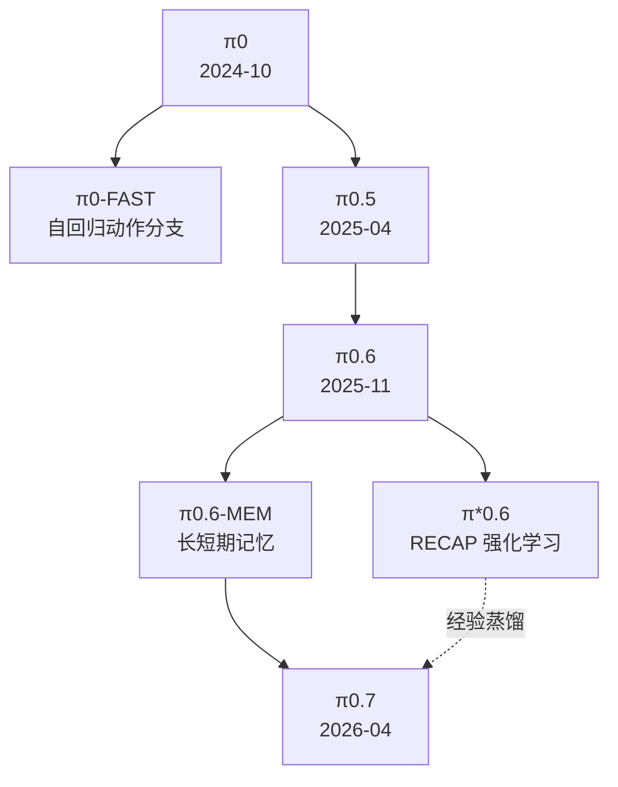

## 一、π0 完整家族



| 模型                                                                | 发布时间       | 架构与动作输出                                                                    | 相比前代的核心变化                                                         | 开放情况       |
| ----------------------------------------------------------------- | ---------- | -------------------------------------------------------------------------- | ----------------------------------------------------------------- | ---------- |
| [π0](https://www.pi.website/blog/pi0)                             | 2024-10-31 | 约3.3B；PaliGemma-3B + 300M action expert；50步连续动作块、conditional flow matching | 首个 PI 通用多本体 VLA，训练数据超过1万机器人小时                                     | 代码和权重开放    |
| [π0-FAST](https://www.pi.website/research/fast)                   | 2025-01-16 | 约3B；不用独立 flow expert，直接自回归生成 FAST 动作 token                                 | DCT、量化、BPE 将高频动作压成约30–60个 token；训练约快5倍，但推理通常比 flow π0 慢           | 开放         |
| [π0.5](https://www.pi.website/blog/pi05)                          | 2025-04-22 | 约3.3B；高层语言子任务 + 低层 flow action expert                                      | 加入网页视觉语言、家庭移动操作、多环境及跨本体数据，重点解决全新家庭和新物体泛化                          | 2025-09 开放 |
| [π0.6](https://website.pi-asset.com/pi06star/PI06_model_card.pdf) | 2025-11-17 | 约5B；Gemma 3 4B + 860M flow expert；FAST/flow 联合监督、KI                        | 更大的视觉语言底座、更丰富机器人数据、更强的零样本 base policy                             | 未开放        |
| [π*0.6](https://www.pi.website/blog/pistar06)                     | 2025-11-17 | π0.6 主体 + advantage conditioning + value model                             | 用 RECAP 将示范、自主 rollout、奖励和人类纠正结合，训练咖啡、叠衣、纸箱等 specialist           | 未开放        |
| [π0.6-MEM](https://www.pi.website/research/memory)                | 2026-03-03 | π0.6 + 短期视频记忆 + 长期文本记忆                                                     | 能记住遮挡前状态、失败尝试及长期任务进度，展示约15分钟任务                                    | 未开放        |
| [π0.7](https://www.pi.website/blog/pi07)                          | 2026-04-16 | 约5B；Gemma 3 + MEM history encoder + 860M flow expert                       | 把指令、子任务、速度/质量/错误标签、控制模式和视觉子目标统一为条件；吸收失败、自主数据和 π*0.6 specialist 经验 | 未开放；当前最新   |

π0.5 后公开的版本实际采用了 [Knowledge Insulation](https://www.pi.website/research/knowledge_insulation)：FAST/web loss 更新 VLM，flow expert 可以读取 VLM，但通过 stop-gradient 避免低层动作训练破坏 VLM 的语义知识。

### 目前能下载的官方 checkpoint

[openpi](https://github.com/Physical-Intelligence/openpi) 当前只有三种 base：

- `pi0_base`

- `pi0_fast_base`

- `pi05_base`

任务 checkpoint 包括：

- `pi0_fast_droid`

- `pi0_droid`

- `pi0_aloha_towel`

- `pi0_aloha_tupperware`

- `pi0_aloha_pen_uncap`

- `pi05_libero`

- `pi05_droid`

这些是平台或任务微调权重，不是新的 π0 代际。代码采用 Apache-2.0，但模型权重还受到 Gemma 使用条款约束。

## 二、哪些名字不是新的 π0 模型

| 名称                                                        | 实际是什么                                                   |
| --------------------------------------------------------- | ------------------------------------------------------- |
| FAST / FAST+                                              | 动作 tokenizer；FAST+ 是在100万条动作序列上训练的通用 tokenizer          |
| π0.5 + KI                                                 | 训练方法和改进 checkpoint，不是 π0.6                              |
| [Hi Robot](https://www.pi.website/research/hirobot)       | 高层 VLM + 低层 π0 的分层系统                                    |
| [RTC](https://www.pi.website/research/real_time_chunking) | action chunk 异步衔接、inpainting 和实时执行方法                    |
| [RLT](https://www.pi.website/research/rlt)                | 附着于冻结 π0.6 的在线 RL token/actor-critic 方法                 |
| π0.5 + Ego                                                | 人类第一视角视频向机器人迁移的实验版本                                     |
| π0-small                                                  | π0 论文中的470M消融模型，没有正式 checkpoint                         |
| π0.7-GC                                                   | π0.7 加生成式视觉子目标的运行配置；辅助 BAGEL world model 不属于 π0.7 的5B参数 |
| DROID/ALOHA/LIBERO 后缀                                     | 同一模型在不同数据或机器人上的 checkpoint                              |

另外，原始 π0 虽然有 VLM 和 action expert，但两者在 flow inference 中联合工作，不能简单等同于 Helix 那种异步快慢双系统。

---

# 三、π0 出生同期：2023–2024 年主要竞争者

这里把“竞争者”限定为多任务、通用或基础模型级机器人策略；普通单任务 Diffusion Policy 不算直接竞品。

| 模型                                                                                                   | 路线                                                 | 与 π0 的关系                                          | 开放情况                  |
| ---------------------------------------------------------------------------------------------------- | -------------------------------------------------- | ------------------------------------------------- | --------------------- |
| [RT-2](https://robotics-transformer2.github.io/) / [RT-X](https://robotics-transformer-x.github.io/) | 5B–55B VLM，将7D动作量化成文本 token，自回归单步生成                | π0 最重要的语义型前驱；语言强，但动作低频、离散、难扩展到双臂高维控制              | RT-2/X 闭源，RT-1-X 部分开放 |
| [Octo](https://octo-models.github.io/)                                                               | 93M generalist transformer + diffusion action head | 开放、多本体、连续 action chunk；但没有联合训练的生成式 VLM            | 开放                    |
| [OpenVLA](https://openvla.github.io/) / [ECoT](https://embodied-cot.github.io/)                      | 7B VLM，离散动作 token；ECoT 先输出具身推理再输出动作                | 原始 π0 最主要的开放 VLA 对照；语义强但串行解码、原版无 action chunk     | 开放                    |
| [RDT-1B](https://rdt-robotics.github.io/rdt-robotics/)                                               | 1.2B DiT、统一100+维动作空间、64步 diffusion chunk           | 强双臂/跨本体 motor foundation model，但不是生成式 VLM         | 开放                    |
| [DiT Policy](https://zhihou7.github.io/dit_policy_vla/)                                              | 334M，视觉语言条件 diffusion transformer                  | 小型连续动作 generalist；动作和语义覆盖弱于 π0                    | 开放                    |
| [GR-2](https://gr2-manipulation.github.io/)                                                          | 视频预测 + cVAE trajectory                             | 较早的 world-model/action 联合路线，但主要是单一本体和私有数据         | 闭源                    |
| [CogACT](https://cogact.github.io/)                                                                  | 约7B cognition VLM + 最大300M DiT action module       | **2024 年结构上最接近 π0 的竞争者**，同样将认知 backbone 与连续动作专家分开 | 开放                    |
| [DiVLA](https://diffusion-vla.github.io/)                                                            | Qwen2-VL + 显式 reasoning + diffusion policy         | π0 发布后一个月出现的直接路线竞争者                               | 部分开放                  |

Diffusion Policy、DP3、ScaleDP、ACT 是重要动作算法底座，但没有通用语言—视觉—机器人预训练，不能和 π0 当作同类 foundation model 横排。

# 四、π0.5/π0.6 同期：2025 年竞争者

| 模型家族                                                                                                                                                                                                  | 核心路线                                                   | 定位与开放性                              |
| ----------------------------------------------------------------------------------------------------------------------------------------------------------------------------------------------------- | ------------------------------------------------------ | ----------------------------------- |
| [Figure Helix](https://www.figure.ai/news/helix)                                                                                                                                                      | 7B System 2 + 80M、200Hz System 1                       | 人形双手、手指和躯干高频闭环；闭源、单一本体体系            |
| [Gemini Robotics](https://deepmind.google/blog/gemini-robotics-brings-ai-into-the-physical-world/) / [1.5](https://deepmind.google/blog/gemini-robotics-15-brings-ai-agents-into-the-physical-world/) | Gemini 2.0 VLA，后续加入行动前推理和跨本体迁移                         | π0.5 最主要的闭源旗舰对手；参数和动作架构未披露          |
| [GR00T N1](https://arxiv.org/abs/2503.14734) / [N1.5](https://research.nvidia.com/labs/gear/gr00t-n1_5/) / [N1.6](https://research.nvidia.com/labs/gear/gr00t-n1_6/)                                  | 2–3B VLM + flow-matching DiT；快慢双系统、人形和跨本体数据            | **最接近 π0 且完整开放的家族之一**               |
| [DexVLA](https://dex-vla.github.io/)                                                                                                                                                                  | Qwen2-VL + 1B diffusion expert + embodiment curriculum | 针对高维双臂、灵巧手和60Hz控制；开放代码及部分 expert    |
| [OpenVLA-OFT](https://openvla-oft.github.io/)                                                                                                                                                         | 将 OpenVLA 改为连续动作、并行解码和 action chunk                    | 很强的开放微调方案，但不是重新预训练的基础模型             |
| [SmolVLA](https://huggingface.co/blog/smolvla)                                                                                                                                                        | 450M VLM + 约100M flow expert                           | 消费级硬件可训练部署的轻量 π0 类路线；开放             |
| [Seed GR-3](https://seed.bytedance.com/en/GR3)                                                                                                                                                        | 约4B Qwen2.5-VL + flow DiT                              | 开放词汇、未知物体、移动双臂及无效指令拒绝；闭源            |
| [Magma](https://www.microsoft.com/en-us/research/blog/magma-a-foundation-model-for-multimodal-ai-agents-across-digital-and-physical-worlds/)                                                          | 8.6B，统一网页/UI/机器人自回归动作 token                            | 语义范围更广，但高频连续控制不如专门 action expert；开放 |
| [MolmoAct](https://allenai.org/blog/molmoact)                                                                                                                                                         | 深度感知 token、视觉 waypoint 和连续动作                           | 开放、强调可解释空间推理                        |
| [X-VLA](https://thu-air-dream.github.io/X-VLA/)                                                                                                                                                       | 0.9B flow model + embodiment soft prompt               | 小模型、显式跨本体适配；开放                      |
| [Galaxea G0](https://arxiv.org/abs/2509.00576)                                                                                                                                                        | 高层视觉语言系统 + 低层动作系统                                      | 国内具有代表性的双系统 VLA                     |
| [LingBot-VLA](https://github.com/robbyant/lingbot-vla)                                                                                                                                                | 多种双臂配置、大规模真实数据、flow action expert                      | 国内较完整的开放 VLA 训练与部署路线                |
| [GEN-0](https://generalistai.com/blog/gen-0)                                                                                                                                                          | 异步多模态输入和动作流                                            | 大规模人类活动数据路线；闭源                      |

# 五、π0.7 同期：2026 年主要竞争阵营

| 阵营                 | 代表模型                                                                                                                                                                                                                                                                                  | 与 π0.7 的竞争点                                              |
| ------------------ | ------------------------------------------------------------------------------------------------------------------------------------------------------------------------------------------------------------------------------------------------------------------------------------- | -------------------------------------------------------- |
| 开放的 VLM + 连续动作专家   | [GR00T N1.7](https://github.com/NVIDIA/Isaac-GR00T)、[Xiaomi-Robotics-0](https://xiaomi-robotics-0.github.io/)、[MolmoAct 2](https://allenai.org/blog/molmoact2)、[Spirit v1.5](https://www.spirit-ai.com/en/blog/spirit-v1-5)                                                           | 当前最适合与 openpi 做代码、训练、推理和跨本体实证比较的一组                       |
| 国内开放/论文型通用 VLA     | [LingBot-VLA 2.0](https://technology.robbyant.com/lingbot-vla-v2)、[InternVLA-A1.5](https://internrobotics.github.io/internvla-a15.github.io/)、[Galaxea G0.5](https://opengalaxea.github.io/G05/)                                                                                      | 分别强调人类视频与全身数据、latent foresight、统一 reasoning/action token |
| 人形全身闭源系统           | [Helix 02](https://www.figure.ai/news/helix-02)、[Gemini Robotics 2](https://deepmind.google/models/gemini-robotics/vla/)                                                                                                                                                              | 全身平衡、手臂、灵巧手、触觉和本体感知；产品能力强但无法公共复现                         |
| World Action Model | [1X World Model Policy](https://www.1x.tech/discover/world-model-self-learning)、[Cosmos Policy](https://research.nvidia.com/labs/cosmos-lab/cosmos-policy/)、[DreamZero](https://dreamzero0.github.io/)、[Cortex 2.0](https://cortex2.sereact.ai/)、[Dyna-2](https://www.dyna.co/dyna-2) | 先预测未来视频/latent、动作及价值，或者从未来视频反推动作；是 π0 式直接 policy 的主要替代路线 |
| 视频示范式上下文学习         | [Skild S1](https://www.skild.ai/blogs/s1)、[GEN-1/1.5](https://generalistai.com/blog/gen-1.5)                                                                                                                                                                                          | 用数秒示范视频或“physical prompt”定义新任务，少量甚至不做梯度更新                |
| 国内闭源统一模型           | [AgiBot GO-2](https://www.agibot.com/article/231/detail/56.html)、[WALL-B](https://x2robot.com/en/news/6a44b3d9af85192fc0a3abd8)                                                                                                                                                       | 强调 reasoning-action unity、世界预测和多本体，但公开架构与可复现评测有限         |

NVIDIA 已预告 GR00T N2，但截至 2026-09-02 尚未正式发布，不能算现有可用模型。Gemini Robotics-ER、V-JEPA2-AC、Cosmos 基础世界模型和 1X Redwood evaluator 则属于高层推理、规划或评估模块，不是低层 VLA。

## 六、最有用的竞争关系判断

- 与 π0 **架构最接近**：CogACT、GR00T N1.x、Seed GR-3、SmolVLA、Xiaomi-Robotics-0、MolmoAct 2。

- 最值得做**开源复现比较**：openpi π0.5、OpenVLA-OFT、RDT-1B、CogACT、GR00T N1.7、SmolVLA、Xiaomi-Robotics-0、MolmoAct 2。

- 当前**闭源旗舰竞争**：π0.7、Gemini Robotics 2、Helix 02、Skild S1、GEN-1.5。

- 最主要的**替代技术路线**：DreamZero/Cosmos/Dyna 的 World Action Model，以及 G0.5 的 reasoning/action 统一自回归路线。

- π0 家族最清晰的演进逻辑是：  
  **连续动作生成 → 开放世界共训练/KI → RL 与自主经验 → 长短期记忆 → 多模态条件组合与 specialist 蒸馏。**

最后要特别注意：各家公司使用的机器人、训练数据、初始状态、超时、人工重置和成功定义都不同，不能直接把宣传成功率排成榜单。真正有意义的是同一本体、同一数据预算和同一评测协议下的比较。

如果有帮助，我可以设置“每月更新 VLA 模型谱系”，持续补充新版本、论文和开放权重。


# π₀模型 VLM部分的PaliGemma和Flow-Matching 的Gemma Expert 是如何协作的


```python
    def embed_prefix(
        self, images, img_masks, lang_tokens, lang_masks
    ) -> tuple[torch.Tensor, torch.Tensor, torch.Tensor]:
        """Embed images with SigLIP and language tokens with embedding layer."""
        embs = []
        pad_masks = []
        att_masks = []

        # Process images
        for img, img_mask in zip(images, img_masks, strict=True):

            def image_embed_func(img):
                return self.paligemma_with_expert.embed_image(img)

            img_emb = self._apply_checkpoint(image_embed_func, img)
            bsize, num_img_embs = img_emb.shape[:2]

            embs.append(img_emb)
            pad_masks.append(img_mask[:, None].expand(bsize, num_img_embs))
            att_masks += [0] * num_img_embs

        # Process language tokens
        def lang_embed_func(lang_tokens):
            lang_emb = self.paligemma_with_expert.embed_language_tokens(lang_tokens)
            return lang_emb

        lang_emb = self._apply_checkpoint(lang_embed_func, lang_tokens)
        embs.append(lang_emb)
        pad_masks.append(lang_masks)

        num_lang_embs = lang_emb.shape[1]
        att_masks += [0] * num_lang_embs

        embs = torch.cat(embs, dim=1)
        pad_masks = torch.cat(pad_masks, dim=1)
        att_masks = torch.tensor(att_masks, dtype=torch.bool, device=pad_masks.device)

        bsize = pad_masks.shape[0]
        att_masks = att_masks[None, :].expand(bsize, len(att_masks))

        return embs, pad_masks, att_masks

    def embed_suffix(self, state, noisy_actions, timestep):
        """Embed state, noisy_actions, timestep to prepare for Expert Gemma processing."""
        embs = []
        pad_masks = []
        att_masks = []

        if self.state_proj.weight.dtype == torch.float32:
            state = state.to(torch.float32)

        def state_proj_func(state):
            return self.state_proj(state)

        state_emb = self._apply_checkpoint(state_proj_func, state)
        embs.append(state_emb[:, None, :])
        bsize = state_emb.shape[0]
        device = state_emb.device

        state_mask = torch.ones(bsize, 1, dtype=torch.bool, device=device)
        pad_masks.append(state_mask)
        att_masks += [1]

        # Embed timestep using sine-cosine positional encoding
        time_emb = create_sinusoidal_pos_embedding(
            timestep,
            self.action_in_proj.out_features,
            min_period=self.config.min_period,
            max_period=self.config.max_period,
            device=timestep.device,
        )
        time_emb = time_emb.type(dtype=timestep.dtype)

        # Fuse timestep + action information using an MLP
        def action_proj_func(noisy_actions):
            return self.action_in_proj(noisy_actions)

        action_emb = self._apply_checkpoint(action_proj_func, noisy_actions)

        time_emb = time_emb[:, None, :].expand_as(action_emb)
        action_time_emb = torch.cat([action_emb, time_emb], dim=2)

        def mlp_func(action_time_emb):
            x = self.action_time_mlp_in(action_time_emb)
            x = F.silu(x)
            return self.action_time_mlp_out(x)

        action_time_emb = self._apply_checkpoint(mlp_func, action_time_emb)
        adarms_cond = None

        embs.append(action_time_emb)
        bsize, action_time_dim = action_time_emb.shape[:2]
        action_time_mask = torch.ones(bsize, action_time_dim, dtype=torch.bool, device=timestep.device)
        pad_masks.append(action_time_mask)

        # Set attention masks so that image, language and state inputs do not attend to action tokens
        att_masks += [1] + ([0] * (self.config.chunk_size - 1))

        embs = torch.cat(embs, dim=1)
        pad_masks = torch.cat(pad_masks, dim=1)
        att_masks = torch.tensor(att_masks, dtype=embs.dtype, device=embs.device)
        att_masks = att_masks[None, :].expand(bsize, len(att_masks))

        return embs, pad_masks, att_masks, adarms_cond

```


